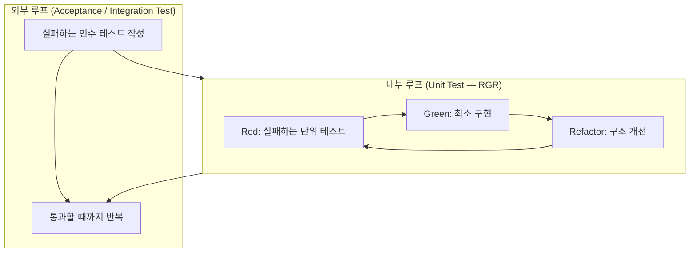

# 01 — Spec / Requirements Analysis — Transcript

| Item | Value |
|------|-------|
| Step | 01 |
| Phase | Spec / Requirements Analysis (Analyze) |
| Branch | spec |
| Exported | 2026-06-11 |
| Source | Cursor Agent Transcript |

---

## Turn 1 — User

현재 폴더의 내용들을 읽어보고 어떤 것을 해야 할지 한번 확인해 볼래?

---

## Turn 1 — Assistant

프로젝트 구조와 README를 먼저 살펴보겠습니다.

---

## Turn 1 — Assistant

현재 프로젝트를 살펴본 결과, **실습용 Unit Converter 과제**이고 README에 적힌 요구사항 대비 **시작 코드만 있는 상태**입니다.

## 현재 폴더 구성

| 파일 | 역할 |
|------|------|
| `README.md` | 과제 설명, 요구사항, 6시간 실습 일정 |
| `UnitConverter.py` | 단일 파일 기본 구현 (~37줄) |
| `unit-converter.jpg` | 설명용 이미지 |

테스트, 설정 파일(JSON/YAML), 가상환경(`venv`) 등은 **아직 없습니다**. 브랜치는 `spec`입니다.

---

## 현재 코드가 하는 일

```1:36:c:\dev\UnitConverter_27\UnitConverter.py
def main():
    input_str = input("Insert value for converting (ex: meter:2.5): ")

    if ':' not in input_str:
        print("Invalid format. Use unit:value (ex: meter:2.5)")
        return
    # ... meter/feet/yard 변환 후 출력 ...
```

- `meter:2.5` 형식 입력
- meter, feet, yard 3단위 변환
- 형식 오류, 숫자 오류, 알 수 없는 단위 처리

---

## README 기준으로 아직 해야 할 일

### 1. 기본 요구사항 (2단계, ~2시간)

| 항목 | 현재 | 해야 할 일 |
|------|------|------------|
| 3단위 변환 | ✅ 부분 구현 | 출력 소수점 등 README 예시(8.2, 2.7)와 맞출지 결정 |
| OCP 설계 | ❌ | 새 단위 추가 시 기존 코드 수정 최소화 (인터페이스/전략 패턴 등) |
| SRP | ❌ | 입력 검증, 변환, 출력을 클래스/모듈로 분리 |
| 입력 검증 | ⚠️ 부분 | **음수** 검증 등 README 품질 요구사항 보완 |

### 2. 테스트 코드 (3단계, ~0.5시간)

- ❌ 테스트 파일 없음
- 단위 변환 정확도 검증 (`1 meter = 3.28084 feet` 등)
- 입력 검증 테스트 (잘못된 형식, 음수, 없는 단위)

### 3. 추가 요구사항 (4단계, ~2시간)

| 추가 기능 | 상태 |
|-----------|------|
| **설정 외부화** | ❌ 비율이 코드에 하드코딩 → JSON/YAML로 분리 |
| **동적 단위 등록** | ❌ 예: `1 cubit = 0.4572 meter` 런타임 등록 |
| **출력 포맷 선택** | ❌ JSON / CSV / 표(table) 형태 출력 |

### 4. 회고 및 발표 (5단계, ~1시간)

- AI 활용 경험, TC 작성 팁, 클린코드/리팩토링 회고 정리

---

## 권장 작업 순서

README의 Activities 순서를 그대로 따르면 됩니다.

1. **분석 (0.5h)** — 지금 하신 것과 같이 README vs `UnitConverter.py` 갭 파악
2. **리팩토링 + 품질 (2h)** — 클래스 분리, OCP/SRP, 입력 검증 강화
3. **TC (0.5h)** — `pytest` 등으로 변환·검증 테스트
4. **추가 기능 (2h)** — 설정 파일, 동적 등록, 출력 포맷 + 해당 TC
5. **회고 (1h)** — 발표 자료 정리

---

## 설계 방향 제안 (참고)

구현 시 README가 요구하는 방향은 대략 다음과 같습니다.

```
config.json/yaml  →  UnitRegistry (단위·비율 로드/등록)
                         ↓
InputParser (검증)  →  Converter (meter 기준 변환)
                         ↓
                    OutputFormatter (text / JSON / CSV)
```

- **OCP**: 새 단위는 설정 또는 등록 API로만 추가
- **SRP**: 파싱 / 변환 / 출력 / 설정 로드를 각각 분리
- **테스트**: 변환 로직을 `main()` 밖으로 빼면 단위 테스트가 쉬워짐

---

**요약**: starter 코드로 3단위 변환만 되고, README의 **설계 원칙(OCP/SRP), 테스트, 설정 외부화, 동적 등록, 출력 포맷**은 전부 남아 있습니다. 6시간 실습이라면 2→3→4 순으로 진행하는 것이 README와도 맞습니다.

특정 단계(예: OCP 구조 설계, pytest 예시)부터 같이 짜고 싶으시면 말씀해 주세요. Agent 모드로 전환하시면 코드 작성도 도와드릴 수 있습니다.

---

## Turn 2 — User

Dual-Track TDD와 ARRR 방식이 무엇인지 알고 있니?

---

## Turn 2 — Assistant

프로젝트와 일반적인 개발 방법론 맥락에서 두 용어를 확인 중입니다.

---

## Turn 3 — User

Dual-Track TDD와 ARRR 방식이 무엇인지 알고 있니?

---

## Turn 3 — Assistant

Dual-Track TDD와 ARRR이 이 프로젝트·교육 맥락에서 어떻게 정의되는지 먼저 확인하겠습니다.

---

## Turn 3 — Assistant

네, 알고 있습니다. 다만 **Dual-Track TDD**는 업계에서 비교적 잘 정립된 개념이고, **ARRR**은 맥락에 따라 의미가 달라질 수 있어서 함께 정리해 드리겠습니다.

---

## Dual-Track TDD (이중 루프 TDD)

**Double Loop TDD**, **Outside-In TDD**, **ATDD + Unit TDD**라고도 부르는 방식입니다. **두 개의 테스트 루프**를 겹쳐서 개발합니다.



| 루프 | 대상 | 시간 단위 | 목적 |
|------|------|-----------|------|
| **외부 루프** | 인수 테스트, 통합 테스트 | 시간~일 | 사용자 관점에서 “기능이 동작하는가” |
| **내부 루프** | 단위 테스트 | 분 단위 | 클래스/함수 수준의 설계와 구현 |

**흐름 요약:**

1. 사용자 시나리오 기준으로 **실패하는 인수 테스트**를 먼저 작성
2. 그 테스트를 통과시키기 위해 **단위 테스트 RGR** 반복
3. 내부 루프가 충분히 진행되면 **외부 테스트 재실행**
4. 통과하면 다음 시나리오로 이동

Unit Converter 과제에 적용하면 예를 들어:

- **외부**: `meter:2.5` 입력 → 모든 단위 변환 결과 출력
- **내부**: `1 meter = 3.28084 feet` 같은 변환 로직 단위 테스트

---

## ARRR

표준 TDD 용어로 **ARRR**이라는 고정 약어는 **RGR(Red-Green-Refactor)**만큼 널리 쓰이지 않습니다. 교육/실습 맥락에서는 보통 아래 중 하나를 가리킵니다.

### 1. RGR의 변형 또는 오타 (가장 흔함)

**Red → Green → Refactor** 3단계를 말하는 경우가 많습니다.

| 단계 | 의미 |
|------|------|
| **Red** | 아직 없는 동작에 대한 **실패하는 테스트** 작성 |
| **Green** | 테스트를 통과시키는 **최소 구현** |
| **Refactor** | 동작은 유지한 채 **코드 구조 개선** |

### 2. AI 활용 TDD에서의 확장 (Analyze + RGR)

생성형 AI 실습에서는 **Analyze**를 앞에 두는 경우가 있습니다.

| 단계 | 의미 |
|------|------|
| **Analyze** | 요구사항 분석, 테스트 계획 수립 (AI와 함께) |
| **Red** | 실패 테스트 작성 |
| **Green** | 최소 구현 |
| **Refactor** | 리팩토링 |

이 경우 **A-R-G-R**처럼 읽히지만, 발음상 **ARRR**로 부르기도 합니다.

### 3. Dual-Track과 결합할 때

Dual-Track TDD 안에서 ARRR(또는 RGR)은 **내부 루프**에 해당합니다.

```
외부: Acceptance Test (Red → Green → Refactor)
  └─ 내부: Unit Test (Red → Green → Refactor) × N회
```

---

## Unit Converter 과제에의 적용

README의 실습 흐름과 잘 맞습니다.

| README 단계 | Dual-Track / ARRR 관점 |
|-------------|------------------------|
| 1. 요구사항 분석 | **Analyze** (Dual-Track 준비) |
| 2. OCP/SRP 구현 | 내부 **RGR** 루프 |
| 3. TC 구현 | 외부(인수) + 내부(단위) 테스트 |
| 4. 추가 요구사항 | 새 시나리오마다 외부 루프 추가 |

예시:

```
[외부] test_convert_meter_to_all_units()
  → [내부] test_meter_to_feet()
  → [내부] test_invalid_input_raises_error()
  → [외부] 통과 확인
```

---

## 정리

- **Dual-Track TDD**: 인수 테스트(바깥) + 단위 테스트(안쪽) 이중 루프
- **ARRR**: 보통 **Analyze + Red + Green + Refactor**이거나, 단순히 **RGR**을 부르는 변형

현재 `UnitConverter_27` README에는 이 용어가 직접 나오지 않아서, **실습 교재나 강사 자료**에 정의된 ARRR이 있다면 그 정의를 기준으로 하는 것이 가장 정확합니다.

교재에 ARRR 각 글자의 풀네임이 적혀 있다면 알려주시면, Unit Converter 과제에 맞춰 구체적인 테스트 작성 순서까지 짜 드리겠습니다.

---

## Turn 4 — User

Dual-Track TDD 의 1번 방식으로 진행을 할꺼야. 현재는 요구사항 브랜치 상태야 내가 단계를 넘어가야 할때 알려줘 그러면 브랜치를 새로 만들게

---

## Turn 4 — Assistant

Dual-Track TDD 1번(외부 인수 테스트 → 내부 RGR) 기준으로 진행 계획을 잡기 위해 현재 브랜치와 코드 상태를 확인합니다.

---

## Turn 4 — Assistant

좋습니다. **Dual-Track TDD 1번(Outside-In: 인수 테스트 먼저 → 내부 RGR)** 기준으로 진행하면 됩니다. 브랜치 전환 시점만 알려드리면 되니, 그에 맞춰 단계를 정리했습니다.

---

## 전체 브랜치 로드맵

| 순서 | 브랜치 (제안) | Dual-Track 역할 | 완료 기준 |
|------|---------------|-----------------|-----------|
| **0** | `spec` ← **현재** | Analyze | 요구사항·시나리오 정리 완료 |
| **1** | `test/acceptance-red` | 외부 루프 **Red** | 실패하는 인수 테스트만 존재 |
| **2** | `feat/basic-green` | 내부 루프 **RGR** | 기본 요구사항 인수 테스트 **Green** |
| **3** | `feat/extras` | 외부+내부 루프 반복 | 추가 요구사항 3개 + TC Green |
| **4** | `docs/retro` (선택) | 회고 | 발표/회고 정리 |

---

## 지금 — `spec` 브랜치에서 할 일

**코드는 아직 건드리지 않습니다.** 분석과 테스트 설계만 합니다.

### 1. 인수 테스트 시나리오 (외부 루프 후보)

README 기준으로 최소 이 정도를 정리하면 다음 단계로 넘어갈 수 있습니다.

| # | 시나리오 | Given | When | Then |
|---|----------|-------|------|------|
| AT-1 | 정상 변환 | meter/feet/yard 중 하나 | `meter:2.5` 입력 | 3단위 모두 출력 |
| AT-2 | 형식 오류 | 잘못된 입력 | `meter2.5` (콜론 없음) | 오류 메시지 |
| AT-3 | 숫자 오류 | 잘못된 값 | `meter:abc` | 오류 메시지 |
| AT-4 | 음수 | 음수 값 | `meter:-1` | 오류 메시지 |
| AT-5 | 없는 단위 | 미등록 단위 | `mile:1` | 오류 메시지 |

### 2. 내부 루프(단위 테스트) 후보 미리 적어 두기

인수 테스트를 Green으로 만들 때 필요할 **단위 테스트 목록**만 미리 적어 두면 됩니다.

- `test_meter_to_feet` — `2.5 m → 8.2 feet` (반올림 규칙 포함)
- `test_meter_to_yard`
- `test_feet_to_meter` (역변환)
- `test_parse_input_valid / invalid`
- `test_unknown_unit_raises`

### 3. 설계 방향 메모 (OCP/SRP)

- `InputParser` — 입력 파싱·검증
- `UnitRegistry` / `Converter` — meter 기준 변환
- `OutputFormatter` — 출력 (나중에 JSON/CSV 확장)

---

## 다음 브�anch 만들 타이밍

아래 **3가지가 모두 끝나면** 알려주세요. 그때 **`test/acceptance-red`** 브랜치를 만드시면 됩니다.

```
✅ spec에서 할 일 체크리스트
□ AT-1 ~ AT-5 시나리오 표 작성 (또는 Given/When/Then 문서)
□ 내부 단위 테스트 목록 5~10개 정리
□ 클래스 역할 분리 메모 (Parser / Converter / Formatter)
□ 변환 비율·반올림 규칙 확인 (8.2 feet는 소수 1자리인지 등)
```

**→ 위 체크리스트 완료 시:**  
`spec`에서 `test/acceptance-red` 브랜치 생성  
→ 그때 제가 **실패하는 인수 테스트만** 작성하는 단계를 안내합니다 (구현 코드 없음 = 외부 Red).

---

## 이후 브랜치 전환 타이밍 (미리 참고)

| 완료되면 알려주세요 | 만들 브랜치 | 다음 작업 |
|---------------------|-------------|-----------|
| 인수 테스트 전부 **Red** 확인 | `feat/basic-green` | 내부 RGR로 구현 |
| AT-1~AT-5 **Green** | `feat/extras` | 설정 외부화·동적 등록·출력 포맷 |
| 추가 요구사항 AT+UT **Green** | (main 머지 또는 `docs/retro`) | 회고·발표 |

---

## Dual-Track 1번 진행 흐름 (한눈에)

```
spec (Analyze)
  ↓  ← 지금 여기
test/acceptance-red  [외부 Red: 인수 테스트만, 전부 실패]
  ↓
feat/basic-green     [내부 RGR 반복 → 외부 Green]
  ↓
feat/extras          [새 인수 테스트 Red → 내부 RGR → Green]
  ↓
회고
```

---

**지금은 `spec`에 머무르시면 됩니다.**  
시나리오 표나 단위 테스트 목록을 정리하셨거나, “분석 끝났어”라고 말씀해 주시면 **`test/acceptance-red` 브랜치 생성**을 알려드리고, 그다음 실패하는 인수 테스트 작성 단계로 넘어가겠습니다.

---

## Turn 5 — User

각 단계별로 진행할때, Report 폴더에 보고서 생성하고, Prompting 폴더에 Transcript도 Export 해줘
생성 및 Export할때 제목에 Numbering을 일관성 있게 해줘

---

## Turn 5 — Assistant

Report·Prompting 폴더 구조와 번호 체계를 확인한 뒤, 현재 spec 단계 보고서와 Transcript를 생성합니다.
