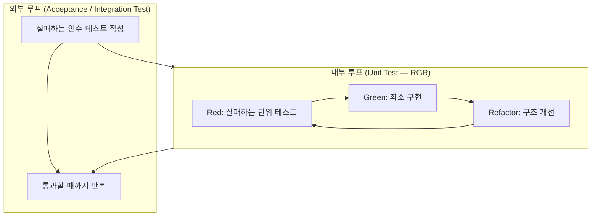

# 02 — Acceptance Test Red — Transcript

| Item | Value |
|------|-------|
| Step | 02 |
| Phase | Acceptance Test Red (Outer Loop) |
| Branch | 
ed |
| Exported | 2026-06-11 |
| Source | Cursor Agent Transcript |

---

## Turn 1 — User

현재 폴더의 내용들을 읽어보고 어떤 것을 해야 할지 한번 확인해 볼래?

---

## Turn 1 — Assistant

프로젝트 구조와 README를 먼저 살펴보겠습니다.

---

## Turn 1 — Assistant

현재 프로젝트를 살펴본 결과, **실습용 Unit Converter 과제**이고 README에 적힌 요구사항 대비 **시작 코드만 있는 상태**입니다.

## 현재 폴더 구성

| 파일 | 역할 |
|------|------|
| `README.md` | 과제 설명, 요구사항, 6시간 실습 일정 |
| `UnitConverter.py` | 단일 파일 기본 구현 (~37줄) |
| `unit-converter.jpg` | 설명용 이미지 |

테스트, 설정 파일(JSON/YAML), 가상환경(`venv`) 등은 **아직 없습니다**. 브랜치는 `spec`입니다.

---

## 현재 코드가 하는 일

```1:36:c:\dev\UnitConverter_27\UnitConverter.py
def main():
    input_str = input("Insert value for converting (ex: meter:2.5): ")

    if ':' not in input_str:
        print("Invalid format. Use unit:value (ex: meter:2.5)")
        return
    # ... meter/feet/yard 변환 후 출력 ...
```

- `meter:2.5` 형식 입력
- meter, feet, yard 3단위 변환
- 형식 오류, 숫자 오류, 알 수 없는 단위 처리

---

## README 기준으로 아직 해야 할 일

### 1. 기본 요구사항 (2단계, ~2시간)

| 항목 | 현재 | 해야 할 일 |
|------|------|------------|
| 3단위 변환 | ✅ 부분 구현 | 출력 소수점 등 README 예시(8.2, 2.7)와 맞출지 결정 |
| OCP 설계 | ❌ | 새 단위 추가 시 기존 코드 수정 최소화 (인터페이스/전략 패턴 등) |
| SRP | ❌ | 입력 검증, 변환, 출력을 클래스/모듈로 분리 |
| 입력 검증 | ⚠️ 부분 | **음수** 검증 등 README 품질 요구사항 보완 |

### 2. 테스트 코드 (3단계, ~0.5시간)

- ❌ 테스트 파일 없음
- 단위 변환 정확도 검증 (`1 meter = 3.28084 feet` 등)
- 입력 검증 테스트 (잘못된 형식, 음수, 없는 단위)

### 3. 추가 요구사항 (4단계, ~2시간)

| 추가 기능 | 상태 |
|-----------|------|
| **설정 외부화** | ❌ 비율이 코드에 하드코딩 → JSON/YAML로 분리 |
| **동적 단위 등록** | ❌ 예: `1 cubit = 0.4572 meter` 런타임 등록 |
| **출력 포맷 선택** | ❌ JSON / CSV / 표(table) 형태 출력 |

### 4. 회고 및 발표 (5단계, ~1시간)

- AI 활용 경험, TC 작성 팁, 클린코드/리팩토링 회고 정리

---

## 권장 작업 순서

README의 Activities 순서를 그대로 따르면 됩니다.

1. **분석 (0.5h)** — 지금 하신 것과 같이 README vs `UnitConverter.py` 갭 파악
2. **리팩토링 + 품질 (2h)** — 클래스 분리, OCP/SRP, 입력 검증 강화
3. **TC (0.5h)** — `pytest` 등으로 변환·검증 테스트
4. **추가 기능 (2h)** — 설정 파일, 동적 등록, 출력 포맷 + 해당 TC
5. **회고 (1h)** — 발표 자료 정리

---

## 설계 방향 제안 (참고)

구현 시 README가 요구하는 방향은 대략 다음과 같습니다.

```
config.json/yaml  →  UnitRegistry (단위·비율 로드/등록)
                         ↓
InputParser (검증)  →  Converter (meter 기준 변환)
                         ↓
                    OutputFormatter (text / JSON / CSV)
```

- **OCP**: 새 단위는 설정 또는 등록 API로만 추가
- **SRP**: 파싱 / 변환 / 출력 / 설정 로드를 각각 분리
- **테스트**: 변환 로직을 `main()` 밖으로 빼면 단위 테스트가 쉬워짐

---

**요약**: starter 코드로 3단위 변환만 되고, README의 **설계 원칙(OCP/SRP), 테스트, 설정 외부화, 동적 등록, 출력 포맷**은 전부 남아 있습니다. 6시간 실습이라면 2→3→4 순으로 진행하는 것이 README와도 맞습니다.

특정 단계(예: OCP 구조 설계, pytest 예시)부터 같이 짜고 싶으시면 말씀해 주세요. Agent 모드로 전환하시면 코드 작성도 도와드릴 수 있습니다.

---

## Turn 2 — User

Dual-Track TDD와 ARRR 방식이 무엇인지 알고 있니?

---

## Turn 2 — Assistant

프로젝트와 일반적인 개발 방법론 맥락에서 두 용어를 확인 중입니다.

---

## Turn 3 — User

Dual-Track TDD와 ARRR 방식이 무엇인지 알고 있니?

---

## Turn 3 — Assistant

Dual-Track TDD와 ARRR이 이 프로젝트·교육 맥락에서 어떻게 정의되는지 먼저 확인하겠습니다.

---

## Turn 3 — Assistant

네, 알고 있습니다. 다만 **Dual-Track TDD**는 업계에서 비교적 잘 정립된 개념이고, **ARRR**은 맥락에 따라 의미가 달라질 수 있어서 함께 정리해 드리겠습니다.

---

## Dual-Track TDD (이중 루프 TDD)

**Double Loop TDD**, **Outside-In TDD**, **ATDD + Unit TDD**라고도 부르는 방식입니다. **두 개의 테스트 루프**를 겹쳐서 개발합니다.



| 루프 | 대상 | 시간 단위 | 목적 |
|------|------|-----------|------|
| **외부 루프** | 인수 테스트, 통합 테스트 | 시간~일 | 사용자 관점에서 “기능이 동작하는가” |
| **내부 루프** | 단위 테스트 | 분 단위 | 클래스/함수 수준의 설계와 구현 |

**흐름 요약:**

1. 사용자 시나리오 기준으로 **실패하는 인수 테스트**를 먼저 작성
2. 그 테스트를 통과시키기 위해 **단위 테스트 RGR** 반복
3. 내부 루프가 충분히 진행되면 **외부 테스트 재실행**
4. 통과하면 다음 시나리오로 이동

Unit Converter 과제에 적용하면 예를 들어:

- **외부**: `meter:2.5` 입력 → 모든 단위 변환 결과 출력
- **내부**: `1 meter = 3.28084 feet` 같은 변환 로직 단위 테스트

---

## ARRR

표준 TDD 용어로 **ARRR**이라는 고정 약어는 **RGR(Red-Green-Refactor)**만큼 널리 쓰이지 않습니다. 교육/실습 맥락에서는 보통 아래 중 하나를 가리킵니다.

### 1. RGR의 변형 또는 오타 (가장 흔함)

**Red → Green → Refactor** 3단계를 말하는 경우가 많습니다.

| 단계 | 의미 |
|------|------|
| **Red** | 아직 없는 동작에 대한 **실패하는 테스트** 작성 |
| **Green** | 테스트를 통과시키는 **최소 구현** |
| **Refactor** | 동작은 유지한 채 **코드 구조 개선** |

### 2. AI 활용 TDD에서의 확장 (Analyze + RGR)

생성형 AI 실습에서는 **Analyze**를 앞에 두는 경우가 있습니다.

| 단계 | 의미 |
|------|------|
| **Analyze** | 요구사항 분석, 테스트 계획 수립 (AI와 함께) |
| **Red** | 실패 테스트 작성 |
| **Green** | 최소 구현 |
| **Refactor** | 리팩토링 |

이 경우 **A-R-G-R**처럼 읽히지만, 발음상 **ARRR**로 부르기도 합니다.

### 3. Dual-Track과 결합할 때

Dual-Track TDD 안에서 ARRR(또는 RGR)은 **내부 루프**에 해당합니다.

```
외부: Acceptance Test (Red → Green → Refactor)
  └─ 내부: Unit Test (Red → Green → Refactor) × N회
```

---

## Unit Converter 과제에의 적용

README의 실습 흐름과 잘 맞습니다.

| README 단계 | Dual-Track / ARRR 관점 |
|-------------|------------------------|
| 1. 요구사항 분석 | **Analyze** (Dual-Track 준비) |
| 2. OCP/SRP 구현 | 내부 **RGR** 루프 |
| 3. TC 구현 | 외부(인수) + 내부(단위) 테스트 |
| 4. 추가 요구사항 | 새 시나리오마다 외부 루프 추가 |

예시:

```
[외부] test_convert_meter_to_all_units()
  → [내부] test_meter_to_feet()
  → [내부] test_invalid_input_raises_error()
  → [외부] 통과 확인
```

---

## 정리

- **Dual-Track TDD**: 인수 테스트(바깥) + 단위 테스트(안쪽) 이중 루프
- **ARRR**: 보통 **Analyze + Red + Green + Refactor**이거나, 단순히 **RGR**을 부르는 변형

현재 `UnitConverter_27` README에는 이 용어가 직접 나오지 않아서, **실습 교재나 강사 자료**에 정의된 ARRR이 있다면 그 정의를 기준으로 하는 것이 가장 정확합니다.

교재에 ARRR 각 글자의 풀네임이 적혀 있다면 알려주시면, Unit Converter 과제에 맞춰 구체적인 테스트 작성 순서까지 짜 드리겠습니다.

---

## Turn 4 — User

Dual-Track TDD 의 1번 방식으로 진행을 할꺼야. 현재는 요구사항 브랜치 상태야 내가 단계를 넘어가야 할때 알려줘 그러면 브랜치를 새로 만들게

---

## Turn 4 — Assistant

Dual-Track TDD 1번(외부 인수 테스트 → 내부 RGR) 기준으로 진행 계획을 잡기 위해 현재 브랜치와 코드 상태를 확인합니다.

---

## Turn 4 — Assistant

좋습니다. **Dual-Track TDD 1번(Outside-In: 인수 테스트 먼저 → 내부 RGR)** 기준으로 진행하면 됩니다. 브랜치 전환 시점만 알려드리면 되니, 그에 맞춰 단계를 정리했습니다.

---

## 전체 브랜치 로드맵

| 순서 | 브랜치 (제안) | Dual-Track 역할 | 완료 기준 |
|------|---------------|-----------------|-----------|
| **0** | `spec` ← **현재** | Analyze | 요구사항·시나리오 정리 완료 |
| **1** | `test/acceptance-red` | 외부 루프 **Red** | 실패하는 인수 테스트만 존재 |
| **2** | `feat/basic-green` | 내부 루프 **RGR** | 기본 요구사항 인수 테스트 **Green** |
| **3** | `feat/extras` | 외부+내부 루프 반복 | 추가 요구사항 3개 + TC Green |
| **4** | `docs/retro` (선택) | 회고 | 발표/회고 정리 |

---

## 지금 — `spec` 브랜치에서 할 일

**코드는 아직 건드리지 않습니다.** 분석과 테스트 설계만 합니다.

### 1. 인수 테스트 시나리오 (외부 루프 후보)

README 기준으로 최소 이 정도를 정리하면 다음 단계로 넘어갈 수 있습니다.

| # | 시나리오 | Given | When | Then |
|---|----------|-------|------|------|
| AT-1 | 정상 변환 | meter/feet/yard 중 하나 | `meter:2.5` 입력 | 3단위 모두 출력 |
| AT-2 | 형식 오류 | 잘못된 입력 | `meter2.5` (콜론 없음) | 오류 메시지 |
| AT-3 | 숫자 오류 | 잘못된 값 | `meter:abc` | 오류 메시지 |
| AT-4 | 음수 | 음수 값 | `meter:-1` | 오류 메시지 |
| AT-5 | 없는 단위 | 미등록 단위 | `mile:1` | 오류 메시지 |

### 2. 내부 루프(단위 테스트) 후보 미리 적어 두기

인수 테스트를 Green으로 만들 때 필요할 **단위 테스트 목록**만 미리 적어 두면 됩니다.

- `test_meter_to_feet` — `2.5 m → 8.2 feet` (반올림 규칙 포함)
- `test_meter_to_yard`
- `test_feet_to_meter` (역변환)
- `test_parse_input_valid / invalid`
- `test_unknown_unit_raises`

### 3. 설계 방향 메모 (OCP/SRP)

- `InputParser` — 입력 파싱·검증
- `UnitRegistry` / `Converter` — meter 기준 변환
- `OutputFormatter` — 출력 (나중에 JSON/CSV 확장)

---

## 다음 브�anch 만들 타이밍

아래 **3가지가 모두 끝나면** 알려주세요. 그때 **`test/acceptance-red`** 브랜치를 만드시면 됩니다.

```
✅ spec에서 할 일 체크리스트
□ AT-1 ~ AT-5 시나리오 표 작성 (또는 Given/When/Then 문서)
□ 내부 단위 테스트 목록 5~10개 정리
□ 클래스 역할 분리 메모 (Parser / Converter / Formatter)
□ 변환 비율·반올림 규칙 확인 (8.2 feet는 소수 1자리인지 등)
```

**→ 위 체크리스트 완료 시:**  
`spec`에서 `test/acceptance-red` 브랜치 생성  
→ 그때 제가 **실패하는 인수 테스트만** 작성하는 단계를 안내합니다 (구현 코드 없음 = 외부 Red).

---

## 이후 브랜치 전환 타이밍 (미리 참고)

| 완료되면 알려주세요 | 만들 브랜치 | 다음 작업 |
|---------------------|-------------|-----------|
| 인수 테스트 전부 **Red** 확인 | `feat/basic-green` | 내부 RGR로 구현 |
| AT-1~AT-5 **Green** | `feat/extras` | 설정 외부화·동적 등록·출력 포맷 |
| 추가 요구사항 AT+UT **Green** | (main 머지 또는 `docs/retro`) | 회고·발표 |

---

## Dual-Track 1번 진행 흐름 (한눈에)

```
spec (Analyze)
  ↓  ← 지금 여기
test/acceptance-red  [외부 Red: 인수 테스트만, 전부 실패]
  ↓
feat/basic-green     [내부 RGR 반복 → 외부 Green]
  ↓
feat/extras          [새 인수 테스트 Red → 내부 RGR → Green]
  ↓
회고
```

---

**지금은 `spec`에 머무르시면 됩니다.**  
시나리오 표나 단위 테스트 목록을 정리하셨거나, “분석 끝났어”라고 말씀해 주시면 **`test/acceptance-red` 브랜치 생성**을 알려드리고, 그다음 실패하는 인수 테스트 작성 단계로 넘어가겠습니다.

---

## Turn 5 — User

각 단계별로 진행할때, Report 폴더에 보고서 생성하고, Prompting 폴더에 Transcript도 Export 해줘
생성 및 Export할때 제목에 Numbering을 일관성 있게 해줘

---

## Turn 5 — Assistant

Report·Prompting 폴더 구조와 번호 체계를 확인한 뒤, 현재 spec 단계 보고서와 Transcript를 생성합니다.

---

## Turn 5 — Assistant

번호 체계를 정의하고, 01단계 보고서와 Transcript를 생성합니다.

---

## Turn 5 — Assistant

앞으로 각 단계마다 **동일 번호 체계**로 Report와 Transcript를 생성·Export하겠습니다.

---

## Numbering 규칙

| 유형 | 경로 형식 |
|------|-----------|
| Report | `Report/{NN}-{phase-slug}-report.md` |
| Transcript | `Prompting/{NN}-{phase-slug}-transcript.md` |

인덱스: `Report/00-index.md`, `Prompting/00-index.md`

---

## 01단계 — 지금 생성된 파일

| No | Report | Transcript |
|----|--------|------------|
| **01** | [Report/01-spec-requirements-analysis-report.md](Report/01-spec-requirements-analysis-report.md) | [Prompting/01-spec-requirements-analysis-transcript.md](Prompting/01-spec-requirements-analysis-transcript.md) |

**01 Report**에는 다음이 포함되어 있습니다.
- 프로젝트·갭 분석
- Dual-Track TDD 브랜치 로드맵
- AT-1~AT-5 인수 시나리오
- UT-1~UT-9 단위 테스트 후보
- OCP/SRP 설계 방향
- spec 체크리스트

**01 Transcript**에는 spec 단계까지의 AI 대화(Turn 1~4)가 Export되어 있습니다.

---

## 이후 단계 예정

| No | Phase | Branch |
|----|-------|--------|
| 02 | Acceptance Test Red | `test/acceptance-red` |
| 03 | Basic Implementation Green | `feat/basic-green` |
| 04 | Extra Requirements | `feat/extras` |
| 05 | Retrospective | `docs/retro` |

각 단계 **완료 시** 해당 번호의 Report + Transcript를 생성합니다.

---

## 다음 브랜치 전환

01 Report §8 체크리스트 중 **반올림 규칙(소수 1자리)**만 확정하면 spec 단계 완료입니다.

확정 후 **「분석 끝났어」**라고 알려주시면:
1. `test/acceptance-red` 브랜치 생성 안내
2. `02-acceptance-red-report.md` / `02-acceptance-red-transcript.md` 생성

으로 진행하겠습니다.

---

## Turn 6 — User

Dual-Track 1번 진행하고 있는데 끝난거니? 아니면 더 확인해야 할 것이 있나요?

---

## Turn 6 — Assistant

01단계(spec/Analyze) 완료 여부를 Report 체크리스트 기준으로 확인합니다.

---

## Turn 6 — Assistant

**아직 끝난 것이 아닙니다.** Dual-Track 1번 전체 중 **01단계(Analyze / `spec`)만 거의 끝난 상태**이고, 그 안에서도 **한 가지는 확정이 필요**합니다.

---

## Dual-Track 1번 전체 진행 상황

```
spec (Analyze)          ← 지금 여기 (거의 완료)
  ↓
test/acceptance-red     ← 아직 안 함 (외부 Red)
  ↓
feat/basic-green        ← 아직 안 함 (내부 RGR → Green)
  ↓
feat/extras             ← 아직 안 함
  ↓
회고
```

| 단계 | 상태 | 설명 |
|------|------|------|
| **01 spec (Analyze)** | ⚠️ **거의 완료** | 분석·시나리오·설계 메모 완료, 반올림 규칙만 확정 필요 |
| **02 acceptance-red** | ❌ 미시작 | 실패하는 인수 테스트 작성 |
| **03 basic-green** | ❌ 미시작 | 단위 테스트 RGR + 구현 |
| **04 extras** | ❌ 미시작 | 추가 요구사항 3건 |
| **05 retro** | ❌ 미시작 | 회고·발표 |

---

## 01 spec 단계 — 체크리스트

| 항목 | 상태 |
|------|------|
| AT-1 ~ AT-5 인수 시나리오 | ✅ Report §5 |
| UT-1 ~ UT-9 단위 테스트 목록 | ✅ Report §6 |
| Parser / Converter / Formatter 역할 분리 | ✅ Report §7 |
| **반올림 규칙** | ⚠️ **미확정** |

README 예시 `8.2 feet`, `2.7 yard` 기준으로는 **소수 1자리 반올림**이 자연스럽습니다. 이대로 가도 될지 한 번만 정해 주시면 spec 단계는 **완료**로 볼 수 있습니다.

---

## spec 넘어가기 전에 선택적으로 확인할 것

필수는 아니지만, 02단계 인수 테스트 작성 전에 정해 두면 좋습니다.

1. **오류 메시지** — starter 코드 문구 그대로 쓸지, 통일할지  
   - 예: `"Invalid format. Use unit:value (ex: meter:2.5)"`
2. **음수 0 처리** — `meter:0`은 허용할지 (보통 허용)
3. **Report/Prompting 커밋** — `Report/`, `Prompting/` 폴더가 아직 untracked 상태입니다. spec 산출물로 커밋해 두면 좋습니다.

---

## 정리

| 질문 | 답 |
|------|-----|
| Dual-Track 1번 전체가 끝났나? | **아니요.** Analyze만 거의 끝 |
| spec(01)이 끝났나? | **반올림 규칙만 확정하면 끝** |
| 더 확인할 것? | 반올림(필수), 오류 메시지·0 허용(선택) |

**「소수 1자리 반올림으로 진행」**이라고 확인해 주시면 spec 완료로 보고, **`test/acceptance-red` 브랜치 생성**과 **02단계(실패하는 인수 테스트 작성)**로 넘어가면 됩니다.

---

## Turn 7 — User

소수 1자리 반올림으로 진행
오류 메시지·0 허용

---

## Turn 7 — Assistant

확정 사항을 Report에 반영하고 spec 단계를 완료 처리합니다.

---

## Turn 7 — Assistant

**01 spec (Analyze) 단계가 완료되었습니다.** 확정 내용을 Report에 반영해 두었습니다.

---

## 확정된 규칙

| 항목 | 결정 |
|------|------|
| 반올림 | 변환 결과 **소수 1자리** |
| 0 | `meter:0` **허용** |
| 음수 | `meter:-1` **거부** |
| 오류 메시지 | starter 코드 문구 유지 |

```
Invalid format. Use unit:value (ex: meter:2.5)
Invalid number: {value}
Unknown unit: {unit}
```

인수 시나리오도 **AT-1b (`meter:0`)** 를 추가했습니다.

---

## 다음 할 일

### 1. `spec` 브랜치 커밋 (권장)

```powershell
git add Report/ Prompting/
git commit -m "docs: complete 01 spec analysis report and transcript"
```

### 2. 02 브랜치 생성

```powershell
git checkout -b test/acceptance-red
```

브랜치 만드신 뒤 **「02 시작」**이라고 알려주시면:

- 실패하는 **인수 테스트만** 작성 (외부 Red)
- `Report/02-acceptance-red-report.md`
- `Prompting/02-acceptance-red-transcript.md`

까지 진행하겠습니다.

---

## Turn 8 — User

spec 브랜치 커밋이 main에 병합하는 것은 아니지?

---

## Turn 8 — Assistant

Git 브랜치 상태를 확인해 spec 커밋과 main 병합의 차이를 설명하겠습니다.

---

## Turn 8 — Assistant

**맞습니다. `spec` 브랜치에서 커밋하는 것과 `main`에 병합하는 것은 전혀 다른 작업입니다.**

---

## 커밋 vs 병합

| 작업 | 의미 | `main`에 영향 |
|------|------|----------------|
| **`spec`에서 커밋** | `spec` 브랜치에만 변경 이력 저장 | **없음** |
| **`main`에 병합(merge)** | `spec` 내용을 `main`으로 가져옴 | **있음** |

`git commit`은 **현재 브랜치(`spec`)에만** 기록됩니다. `main`은 그대로입니다.

---

## 지금 저장소 상태

```
main  ──●── f4b9e67
spec  ──●── f4b9e67   ← 같은 커밋 (아직 spec 전용 커밋 없음)
```

`spec`과 `main`이 같은 지점을 가리키고 있고, `Report/`, `Prompting/`은 아직 커밋되지 않은 상태로 보입니다.

---

## Dual-Track 진행 흐름에서의 의미

```
main          (최종 완성본 — 실습 끝날 때 머지)
  │
  └── spec              ← 01 Analyze 커밋
        │
        └── test/acceptance-red   ← 02
              │
              └── feat/basic-green  ← 03
                    ...
```

- **`spec` 커밋**: 분석 산출물(Report, Prompting)을 `spec`에만 저장
- **`main` 병합**: 보통 **전체 실습이 끝난 뒤** 또는 PR로 한 번에 합칠 때

중간 단계(`spec`, `test/acceptance-red` 등)는 **각 브랜치에 커밋만** 하고, `main`은 나중에 merge/rebase로 합치면 됩니다.

---

## 요약

- `spec`에서 `git commit` → **`main`에는 반영되지 않음**
- `main`에 반영하려면 **별도로** `git checkout main` → `git merge spec` (또는 PR) 필요

실습 중에는 `main`은 그대로 두고, feature 브랜치들만 쌓아 가는 방식이 일반적입니다.

---

## Turn 9 — User

02 브랜치 생성은 red라고 할게

---

## Turn 9 — Assistant

좋습니다. **02단계 브랜치 이름을 `red`로** 쓰시면 됩니다.

---

## 브랜치 생성

`spec` 커밋 후:

```powershell
git checkout -b red
```

또는 `spec`에서 아직 커밋 전이라면:

```powershell
git checkout spec
git add Report/ Prompting/
git commit -m "docs: complete 01 spec analysis report and transcript"
git checkout -b red
```

---

## 로드맵 (브랜치명 반영)

| No | Branch | 역할 |
|----|--------|------|
| 01 | `spec` | Analyze ✅ |
| 02 | **`red`** | 외부 루프 Red (실패하는 인수 테스트) |
| 03 | `feat/basic-green` (또는 원하시면 `green`) | 내부 RGR → Green |
| 04 | `feat/extras` | 추가 요구사항 |
| 05 | `docs/retro` | 회고 |

Report/Prompting 파일명은 번호 체계 유지 가능합니다.

- `Report/02-acceptance-red-report.md`
- `Prompting/02-acceptance-red-transcript.md`

브랜치는 `red`, 문서 slug는 `acceptance-red`로 두어도 무방합니다.

---

`red` 브랜치 만드신 뒤 **「02 시작」**이라고 알려주시면, Agent 모드에서 인수 테스트(Red) 작성과 02 Report/Transcript 생성을 진행하면 됩니다.

---

## Turn 10 — User

03은 green이라고 할꺼고 04 단계는 제외하고 05를 refactoring으로 할게

---

## Turn 10 — Assistant

브랜치 이름을 그렇게 정리하면 Dual-Track 흐름은 아래와 같습니다.

---

## 확정 브랜치 로드맵

| No | Branch | Dual-Track 역할 | 완료 기준 |
|----|--------|-----------------|-----------|
| 01 | `spec` | Analyze | 요구사항·시나리오·규칙 확정 ✅ |
| 02 | `red` | 외부 Red | 실패하는 인수 테스트만 존재 |
| 03 | `green` | 내부 RGR → 외부 Green | AT-1~AT-5(+AT-1b) **Green** |
| ~~04~~ | *(제외)* | — | 추가 요구사항(설정 외부화·동적 등록·출력 포맷) **진행 안 함** |
| 05 | `refactoring` | Refactor | 구조 개선, 테스트 Green 유지 |

---

## Git 흐름 (예시)

```
main
  └── spec
        └── red
              └── green
                    └── refactoring
```

```powershell
# 02
git checkout -b red

# 03 (red 완료 후)
git checkout -b green

# 05 (green 완료 후, 04 생략)
git checkout -b refactoring
```

---

## 단계별로 할 일

| Branch | 작업 |
|--------|------|
| `red` | 인수 테스트만 작성, **전부 Red** |
| `green` | 단위 테스트 RGR + 최소 구현 → 인수 테스트 **Green** |
| `refactoring` | OCP/SRP 정리, 클래스 분리, 중복 제거 (테스트 Green 유지) |

README **추가 요구사항**(JSON/YAML, cubit 등록, JSON/CSV 출력)은 **04 제외**로 보지 않으면 됩니다.

---

## Report / Prompting 번호 (제안)

| No | Report | Transcript | Branch |
|----|--------|------------|--------|
| 01 | `01-spec-requirements-analysis-report.md` | `01-...-transcript.md` | `spec` ✅ |
| 02 | `02-acceptance-red-report.md` | `02-...-transcript.md` | `red` |
| 03 | `03-basic-green-report.md` | `03-...-transcript.md` | `green` |
| ~~04~~ | — | — | 제외 |
| 05 | `05-refactoring-report.md` | `05-...-transcript.md` | `refactoring` |

브랜치명(`red`, `green`, `refactoring`)과 문서 slug는 위처럼 분리해도 됩니다.

---

## 참고

- `refactoring` 단계에서 README의 **OCP/SRP·입력 검증**을 정리하는 것이 자연스럽습니다.
- 추가 요구사항 3건은 범위에서 빠지므로, `green`에서 **기본 요구사항 + 품질 요구사항**까지 Green이면 `refactoring`으로 넘어가면 됩니다.

`red` 브랜치 만드신 뒤 **「02 시작」**이라고 알려주시면, Agent 모드에서 인수 테스트(Red)와 02 Report/Transcript 작업을 진행하면 됩니다.

---

## Turn 11 — User

나는 .cursor 밑에 rules, skills, commands를 만들거니 각 디렉토리에 추가할 필요가 있으면 나에게 알려줘

---

## Turn 11 — Assistant

프로젝트와 Cursor 설정 스킬을 확인해 `.cursor`에 추가할 rules·skills·commands를 제안하겠습니다.

---

## Turn 11 — Assistant

`.cursor` 아래는 **아직 비어 있으니**, 지금까지 정한 실습 흐름 기준으로 아래처럼 추가하시면 됩니다. (프로젝트 전용이므로 **`.cursor/`를 repo에 두는 것**을 권장합니다.)

---

## 디렉터리 역할 정리

| 디렉터리 | 역할 | 이 프로젝트에서 쓸 때 |
|----------|------|----------------------|
| **`.cursor/rules/`** | 항상/조건부로 AI가 **지켜야 할 규칙** | 브랜치별 금지·허용, 비즈니스 규칙, TDD 제약 |
| **`.cursor/skills/`** | 특정 **워크플로 전체 절차** | 단계 전환, Report/Transcript Export |
| **`.cursor/commands/`** | `/` 슬래시로 **직접 실행** | `red` / `green` / `refactoring` 단계 시작 |

> Cursor는 commands를 skills로 옮기는 방향도 있지만, **단계별로 직접 호출**하려면 commands를 두는 편이 편합니다.

---

## 1. `.cursor/rules/` — 추가 권장 (4개)

### (1) `unit-converter-workflow.mdc` — **필수, alwaysApply: true**

항상 적용되는 **프로젝트 헌법**.

포함할 내용:
- 브랜치: `spec` → `red` → `green` → `refactoring` (04 extras **제외**)
- `main` 자동 merge **금지**
- 단계 완료 시 `Report/{NN}-...-report.md`, `Prompting/{NN}-...-transcript.md` 생성
- 번호: 01 spec, 02 red, 03 green, ~~04~~, 05 refactoring
- 사용자가 브랜치 생성·전환 — AI는 **「다음 브랜치 만들 시점」만 안내**

### (2) `dual-track-tdd-branches.mdc` — **필수, alwaysApply: true**

브랜치별 **Dual-Track 제약** (가장 중요).

| Branch | 허용 | 금지 |
|--------|------|------|
| `red` | 인수/통합 테스트만 | 프로덕션 구현 |
| `green` | 단위 테스트 RGR + 최소 구현 | 인수 테스트 수정(통과 목적), 과도한 설계 |
| `refactoring` | 구조 개선 | 동작 변경, 테스트 삭제 |

### (3) `unit-converter-domain.mdc` — **필수, globs: `**/*.py`, `tests/**`**

도메인 규칙 (Report §3 기준):

- `1 meter = 3.28084 feet`, `1.09361 yard`
- 출력 **소수 1자리 반올림**
- `0` 허용, **음수 거부**
- 오류 메시지 starter 문구 유지
- OCP/SRP: `InputParser`, `UnitRegistry`, `Converter`, `OutputFormatter`
- README **추가 요구사항**(JSON/YAML, cubit, JSON/CSV) **범위外**

### (4) `report-prompting-format.mdc` — **권장, globs: `Report/**`, `Prompting/**`**

- 파일명: `{NN}-{phase-slug}-report.md` / `-transcript.md`
- Report 헤더: Step, Phase, Branch, Status
- Transcript: Turn별 User/Assistant, 도구 로그는 생략 가능

---

## 2. `.cursor/skills/` — 추가 권장 (2~3개)

Skills는 **긴 절차**용. Rules보다 단계·체크리스트가 길어도 됩니다.

### (1) `dual-track-phase/SKILL.md` — **필수**

**언제:** 「02 시작」, 「red 완료」, 브랜치 전환 시

포함:
- 현재 브랜치 확인 → 허용 작업
- AT-1~AT-5, AT-1b 시나리오 참조 (`Report/01-...`)
- 완료 기준 (Red: 전부 fail / Green: AT Green / refactoring: 테스트 Green 유지)
- 다음 브랜치 안내

### (2) `export-phase-artifacts/SKILL.md` — **필수**

**언제:** 단계 완료 시 Report + Transcript Export

포함:
- 번호·slug 매핑 (02=`acceptance-red`, 03=`basic-green`, 05=`refactoring`)
- `00-index.md` 갱신
- Transcript는 Cursor agent-transcripts에서 Export

### (3) `acceptance-test-authoring/SKILL.md` — **red 브랜치용, 선택**

- pytest + subprocess/CLI 인수 테스트 패턴
- AT별 Given/When/Then → 테스트 코드 매핑
- **Red 단계: 테스트만, 구현 없음** 반복 강조

---

## 3. `.cursor/commands/` — 추가 권장 (4개)

슬래시로 **단계 시작**할 때 쓰면 좋습니다. 각 파일은 `.md`, 본문에 지시만 적습니다.

| 파일 | 용도 |
|------|------|
| `phase-red.md` | `red`에서 실패 인수 테스트만 작성 |
| `phase-green.md` | `green`에서 UT RGR + 최소 구현 |
| `phase-refactoring.md` | `refactoring`에서 리팩터만 (Green 유지) |
| `export-artifacts.md` | 현재 단계 Report + Transcript Export |

각 command 첫 줄 예:

```markdown
# Phase Red — Acceptance tests only (Dual-Track outer loop)
```

commands 본문에 넣을 한 줄 요약:
- `phase-red`: 「구현 코드 작성 금지. AT-1~AT-5, AT-1b 실패 테스트만.」
- `phase-green`: 「인수 테스트 Green까지 내부 RGR. 최소 구현만.」
- `phase-refactoring`: 「동작 변경 없이 OCP/SRP 정리. 모든 테스트 Green.」
- `export-artifacts`: 「Report + Prompting + index 갱신. 번호 규칙 준수.」

---

## 우선순위 (만들 순서)

```
1. rules/unit-converter-workflow.mdc
2. rules/dual-track-tdd-branches.mdc
3. rules/unit-converter-domain.mdc
4. skills/dual-track-phase/SKILL.md
5. skills/export-phase-artifacts/SKILL.md
6. commands/phase-red.md, phase-green.md, phase-refactoring.md, export-artifacts.md
7. rules/report-prompting-format.mdc (선택)
8. skills/acceptance-test-authoring/SKILL.md (red 직전)
```

---

## 만들지 않아도 되는 것

| 항목 | 이유 |
|------|------|
| `extras` / 04 관련 rule·command | 범위 제외로 명시만 하면 됨 |
| `main` merge command | 실습 중 merge 안 함 — rule에 **금지**만 |
| 전역 `~/.cursor/` | 이 repo 전용 workflow면 **프로젝트 `.cursor/`**면 충분 |

---

## 한 가지 정리

`Report/01-spec-requirements-analysis-report.md` §4.2 브랜치명은 아직 `test/acceptance-red` 등 **구버전**입니다. rule/skill에 넣을 **최종 브랜치명**은 아래로 통일하세요.

```
spec → red → green → refactoring
```

---

Agent 모드로 전환하시면 위 파일들을 `.cursor/rules/`, `.cursor/skills/`, `.cursor/commands/`에 **초안까지 생성**해 드릴 수 있습니다. 원하시는 파일만 골라 주셔도 됩니다.

---

## Turn 12 — User

다 만들어주세요

---

## Turn 12 — Assistant

현재 **Ask 모드**라서 `.cursor` 폴더에 파일을 직접 만들 수는 없습니다.

**Agent 모드**로 전환한 뒤 같은 요청(「다 만들어주세요」)을 다시 보내 주시면, 아래를 한 번에 생성하겠습니다.

---

## 생성 예정 목록

### `.cursor/rules/` (4개)
- `unit-converter-workflow.mdc`
- `dual-track-tdd-branches.mdc`
- `unit-converter-domain.mdc`
- `report-prompting-format.mdc`

### `.cursor/skills/` (3개)
- `dual-track-phase/SKILL.md`
- `export-phase-artifacts/SKILL.md`
- `acceptance-test-authoring/SKILL.md`

### `.cursor/commands/` (4개)
- `phase-red.md`
- `phase-green.md`
- `phase-refactoring.md`
- `export-artifacts.md`

---

Agent 모드로 바꾸신 뒤 **「다 만들어주세요」**라고 다시 말씀해 주세요.

---

## Turn 13 — User

다 만들어주세요

---

## Turn 13 — Assistant

`.cursor` rules, skills, commands 전체를 생성합니다. Report의 확정 규칙을 참고합니다.

---

## Turn 13 — Assistant

`.cursor` 설정과 Report 인덱스를 모두 반영했습니다.

---

## 생성된 파일 (11개)

### `.cursor/rules/` (4)
| 파일 | 역할 |
|------|------|
| `unit-converter-workflow.mdc` | 브랜치 로드맵, 산출물, scope, main merge 금지 |
| `dual-track-tdd-branches.mdc` | `red` / `green` / `refactoring` 단계별 허용·금지 |
| `unit-converter-domain.mdc` | 변환 비율, 반올림, 오류 메시지, OCP/SRP |
| `report-prompting-format.mdc` | Report/Transcript 명명·템플릿 |

### `.cursor/skills/` (3)
| Skill | 용도 |
|-------|------|
| `dual-track-phase` | 단계 전환·체크리스트 |
| `export-phase-artifacts` | Report + Transcript Export |
| `acceptance-test-authoring` | `red` 브랜치 인수 테스트 작성 |

### `.cursor/commands/` (4)
| Command | 용도 |
|---------|------|
| `/phase-red` | 인수 테스트만 (Red) |
| `/phase-green` | 내부 RGR → Green |
| `/phase-refactoring` | 리팩터 (Green 유지) |
| `/export-artifacts` | 단계별 Report/Transcript Export |

---

## 함께 갱신한 파일

- `Report/00-index.md` — 브랜치 `red` / `green` / `refactoring`, 04 제외
- `Prompting/00-index.md` — 동일 매핑
- `Report/01-spec-requirements-analysis-report.md` §4.2, §9 — 브랜치명 정리

---

## 사용 방법

1. Cursor 채팅에서 `/phase-red` 등 슬래시 명령 실행
2. 단계 완료 시 `/export-artifacts` 또는 “02 Export 해줘” 요청
3. Rules는 Agent가 자동 적용 (`alwaysApply` 2개 + 파일별 globs 2개)

---

## 다음 단계

`spec` 커밋 후 `red` 브랜치를 만드시고 **「02 시작」** 또는 **`/phase-red`** 라고 알려주시면 인수 테스트(Red) 작성을 진행하면 됩니다.

---

## Turn 14 — User

spec 커밋 명령어는?

---

## Turn 14 — Assistant

현재 **`spec` 브랜치**입니다. 아래 순서대로 실행하시면 됩니다.

```powershell
cd c:\dev\UnitConverter_27

git add Report/ Prompting/ .cursor/

git commit -m "docs: complete 01 spec phase (report, transcript, cursor config)"
```

커밋 후 확인:

```powershell
git status
git log -1 --oneline
```

---

### 포함되는 변경

| 경로 | 내용 |
|------|------|
| `Report/` | 01 spec 보고서, index 수정 |
| `Prompting/` | 01 transcript, index 수정 |
| `.cursor/` | rules, skills, commands (신규) |

---

### 참고

- 이 커밋은 **`spec` 브랜치에만** 저장됩니다. **`main`에는 병합되지 않습니다.**
- 커밋 후 02단계:

```powershell
git checkout -b red
```

---

## Turn 15 — User

<cursor_commands>

--- Cursor Command: phase-red ---
# Phase Red — Acceptance tests only (Dual-Track outer loop)

Current branch must be **`red`**.

## Do

1. Confirm branch: `git branch --show-current` → `red`
2. Read scenarios in `Report/01-spec-requirements-analysis-report.md` §5 (AT-1 … AT-5, AT-1b)
3. Add pytest acceptance tests only (CLI/subprocess or thin public API)
4. Run tests; confirm they **fail for the intended reason** (outer Red)
5. On phase complete: run export-artifacts workflow for step **02**

## Do not

- Write production code to make tests pass
- Relax assertions to match starter `UnitConverter.py` gaps
- Implement README step-04 extras

## Done when

- All acceptance tests exist and fail correctly
- Tell user to create branch **`green`**

--- End Command ---
</cursor_commands>

/phase-red
