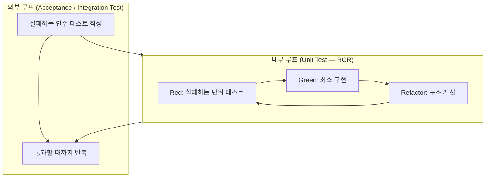

# 03 — Basic Implementation Green — Transcript

| Item | Value |
|------|-------|
| Step | 03 |
| Phase | Basic Implementation Green (Inner RGR) |
| Branch | green |
| Exported | 2026-06-11 |
| Source | Cursor Agent Transcript |

## Attribution

- ## Turn N — User = **사람**
- ## Turn N — Assistant = **AI**

---

---


## Turn 1 — User

현재 폴더의 내용들을 읽어보고 어떤 것을 해야 할지 한번 확인해 볼래?

## Turn 1 — Assistant

프로젝트 구조와 README를 먼저 살펴보겠습니다.

## Turn 1 — Assistant

현재 프로젝트를 살펴본 결과, **실습용 Unit Converter 과제**이고 README에 적힌 요구사항 대비 **시작 코드만 있는 상태**입니다.

## 현재 폴더 구성

| 파일 | 역할 |
|------|------|
| `README.md` | 과제 설명, 요구사항, 6시간 실습 일정 |
| `UnitConverter.py` | 단일 파일 기본 구현 (~37줄) |
| `unit-converter.jpg` | 설명용 이미지 |

테스트, 설정 파일(JSON/YAML), 가상환경(`venv`) 등은 **아직 없습니다**. 브랜치는 `spec`입니다.

---

## 현재 코드가 하는 일

```1:36:c:\dev\UnitConverter_27\UnitConverter.py
def main():
    input_str = input("Insert value for converting (ex: meter:2.5): ")

    if ':' not in input_str:
        print("Invalid format. Use unit:value (ex: meter:2.5)")
        return
    # ... meter/feet/yard 변환 후 출력 ...
```

- `meter:2.5` 형식 입력
- meter, feet, yard 3단위 변환
- 형식 오류, 숫자 오류, 알 수 없는 단위 처리

---

## README 기준으로 아직 해야 할 일

### 1. 기본 요구사항 (2단계, ~2시간)

| 항목 | 현재 | 해야 할 일 |
|------|------|------------|
| 3단위 변환 | ✅ 부분 구현 | 출력 소수점 등 README 예시(8.2, 2.7)와 맞출지 결정 |
| OCP 설계 | ❌ | 새 단위 추가 시 기존 코드 수정 최소화 (인터페이스/전략 패턴 등) |
| SRP | ❌ | 입력 검증, 변환, 출력을 클래스/모듈로 분리 |
| 입력 검증 | ⚠️ 부분 | **음수** 검증 등 README 품질 요구사항 보완 |

### 2. 테스트 코드 (3단계, ~0.5시간)

- ❌ 테스트 파일 없음
- 단위 변환 정확도 검증 (`1 meter = 3.28084 feet` 등)
- 입력 검증 테스트 (잘못된 형식, 음수, 없는 단위)

### 3. 추가 요구사항 (4단계, ~2시간)

| 추가 기능 | 상태 |
|-----------|------|
| **설정 외부화** | ❌ 비율이 코드에 하드코딩 → JSON/YAML로 분리 |
| **동적 단위 등록** | ❌ 예: `1 cubit = 0.4572 meter` 런타임 등록 |
| **출력 포맷 선택** | ❌ JSON / CSV / 표(table) 형태 출력 |

### 4. 회고 및 발표 (5단계, ~1시간)

- AI 활용 경험, TC 작성 팁, 클린코드/리팩토링 회고 정리

---

## 권장 작업 순서

README의 Activities 순서를 그대로 따르면 됩니다.

1. **분석 (0.5h)** — 지금 하신 것과 같이 README vs `UnitConverter.py` 갭 파악
2. **리팩토링 + 품질 (2h)** — 클래스 분리, OCP/SRP, 입력 검증 강화
3. **TC (0.5h)** — `pytest` 등으로 변환·검증 테스트
4. **추가 기능 (2h)** — 설정 파일, 동적 등록, 출력 포맷 + 해당 TC
5. **회고 (1h)** — 발표 자료 정리

---

## 설계 방향 제안 (참고)

구현 시 README가 요구하는 방향은 대략 다음과 같습니다.

```
config.json/yaml  →  UnitRegistry (단위·비율 로드/등록)
                         ↓
InputParser (검증)  →  Converter (meter 기준 변환)
                         ↓
                    OutputFormatter (text / JSON / CSV)
```

- **OCP**: 새 단위는 설정 또는 등록 API로만 추가
- **SRP**: 파싱 / 변환 / 출력 / 설정 로드를 각각 분리
- **테스트**: 변환 로직을 `main()` 밖으로 빼면 단위 테스트가 쉬워짐

---

**요약**: starter 코드로 3단위 변환만 되고, README의 **설계 원칙(OCP/SRP), 테스트, 설정 외부화, 동적 등록, 출력 포맷**은 전부 남아 있습니다. 6시간 실습이라면 2→3→4 순으로 진행하는 것이 README와도 맞습니다.

특정 단계(예: OCP 구조 설계, pytest 예시)부터 같이 짜고 싶으시면 말씀해 주세요. Agent 모드로 전환하시면 코드 작성도 도와드릴 수 있습니다.

## Turn 2 — User

Dual-Track TDD와 ARRR 방식이 무엇인지 알고 있니?

## Turn 2 — Assistant

프로젝트와 일반적인 개발 방법론 맥락에서 두 용어를 확인 중입니다.

## Turn 3 — User

Dual-Track TDD와 ARRR 방식이 무엇인지 알고 있니?

## Turn 3 — Assistant

Dual-Track TDD와 ARRR이 이 프로젝트·교육 맥락에서 어떻게 정의되는지 먼저 확인하겠습니다.

## Turn 3 — Assistant

네, 알고 있습니다. 다만 **Dual-Track TDD**는 업계에서 비교적 잘 정립된 개념이고, **ARRR**은 맥락에 따라 의미가 달라질 수 있어서 함께 정리해 드리겠습니다.

---

## Dual-Track TDD (이중 루프 TDD)

**Double Loop TDD**, **Outside-In TDD**, **ATDD + Unit TDD**라고도 부르는 방식입니다. **두 개의 테스트 루프**를 겹쳐서 개발합니다.



| 루프 | 대상 | 시간 단위 | 목적 |
|------|------|-----------|------|
| **외부 루프** | 인수 테스트, 통합 테스트 | 시간~일 | 사용자 관점에서 “기능이 동작하는가” |
| **내부 루프** | 단위 테스트 | 분 단위 | 클래스/함수 수준의 설계와 구현 |

**흐름 요약:**

1. 사용자 시나리오 기준으로 **실패하는 인수 테스트**를 먼저 작성
2. 그 테스트를 통과시키기 위해 **단위 테스트 RGR** 반복
3. 내부 루프가 충분히 진행되면 **외부 테스트 재실행**
4. 통과하면 다음 시나리오로 이동

Unit Converter 과제에 적용하면 예를 들어:

- **외부**: `meter:2.5` 입력 → 모든 단위 변환 결과 출력
- **내부**: `1 meter = 3.28084 feet` 같은 변환 로직 단위 테스트

---

## ARRR

표준 TDD 용어로 **ARRR**이라는 고정 약어는 **RGR(Red-Green-Refactor)**만큼 널리 쓰이지 않습니다. 교육/실습 맥락에서는 보통 아래 중 하나를 가리킵니다.

### 1. RGR의 변형 또는 오타 (가장 흔함)

**Red → Green → Refactor** 3단계를 말하는 경우가 많습니다.

| 단계 | 의미 |
|------|------|
| **Red** | 아직 없는 동작에 대한 **실패하는 테스트** 작성 |
| **Green** | 테스트를 통과시키는 **최소 구현** |
| **Refactor** | 동작은 유지한 채 **코드 구조 개선** |

### 2. AI 활용 TDD에서의 확장 (Analyze + RGR)

생성형 AI 실습에서는 **Analyze**를 앞에 두는 경우가 있습니다.

| 단계 | 의미 |
|------|------|
| **Analyze** | 요구사항 분석, 테스트 계획 수립 (AI와 함께) |
| **Red** | 실패 테스트 작성 |
| **Green** | 최소 구현 |
| **Refactor** | 리팩토링 |

이 경우 **A-R-G-R**처럼 읽히지만, 발음상 **ARRR**로 부르기도 합니다.

### 3. Dual-Track과 결합할 때

Dual-Track TDD 안에서 ARRR(또는 RGR)은 **내부 루프**에 해당합니다.

```
외부: Acceptance Test (Red → Green → Refactor)
  └─ 내부: Unit Test (Red → Green → Refactor) × N회
```

---

## Unit Converter 과제에의 적용

README의 실습 흐름과 잘 맞습니다.

| README 단계 | Dual-Track / ARRR 관점 |
|-------------|------------------------|
| 1. 요구사항 분석 | **Analyze** (Dual-Track 준비) |
| 2. OCP/SRP 구현 | 내부 **RGR** 루프 |
| 3. TC 구현 | 외부(인수) + 내부(단위) 테스트 |
| 4. 추가 요구사항 | 새 시나리오마다 외부 루프 추가 |

예시:

```
[외부] test_convert_meter_to_all_units()
  → [내부] test_meter_to_feet()
  → [내부] test_invalid_input_raises_error()
  → [외부] 통과 확인
```

---

## 정리

- **Dual-Track TDD**: 인수 테스트(바깥) + 단위 테스트(안쪽) 이중 루프
- **ARRR**: 보통 **Analyze + Red + Green + Refactor**이거나, 단순히 **RGR**을 부르는 변형

현재 `UnitConverter_27` README에는 이 용어가 직접 나오지 않아서, **실습 교재나 강사 자료**에 정의된 ARRR이 있다면 그 정의를 기준으로 하는 것이 가장 정확합니다.

교재에 ARRR 각 글자의 풀네임이 적혀 있다면 알려주시면, Unit Converter 과제에 맞춰 구체적인 테스트 작성 순서까지 짜 드리겠습니다.

## Turn 4 — User

Dual-Track TDD 의 1번 방식으로 진행을 할꺼야. 현재는 요구사항 브랜치 상태야 내가 단계를 넘어가야 할때 알려줘 그러면 브랜치를 새로 만들게

## Turn 4 — Assistant

Dual-Track TDD 1번(외부 인수 테스트 → 내부 RGR) 기준으로 진행 계획을 잡기 위해 현재 브랜치와 코드 상태를 확인합니다.

## Turn 4 — Assistant

좋습니다. **Dual-Track TDD 1번(Outside-In: 인수 테스트 먼저 → 내부 RGR)** 기준으로 진행하면 됩니다. 브랜치 전환 시점만 알려드리면 되니, 그에 맞춰 단계를 정리했습니다.

---

## 전체 브랜치 로드맵

| 순서 | 브랜치 (제안) | Dual-Track 역할 | 완료 기준 |
|------|---------------|-----------------|-----------|
| **0** | `spec` ← **현재** | Analyze | 요구사항·시나리오 정리 완료 |
| **1** | `test/acceptance-red` | 외부 루프 **Red** | 실패하는 인수 테스트만 존재 |
| **2** | `feat/basic-green` | 내부 루프 **RGR** | 기본 요구사항 인수 테스트 **Green** |
| **3** | `feat/extras` | 외부+내부 루프 반복 | 추가 요구사항 3개 + TC Green |
| **4** | `docs/retro` (선택) | 회고 | 발표/회고 정리 |

---

## 지금 — `spec` 브랜치에서 할 일

**코드는 아직 건드리지 않습니다.** 분석과 테스트 설계만 합니다.

### 1. 인수 테스트 시나리오 (외부 루프 후보)

README 기준으로 최소 이 정도를 정리하면 다음 단계로 넘어갈 수 있습니다.

| # | 시나리오 | Given | When | Then |
|---|----------|-------|------|------|
| AT-1 | 정상 변환 | meter/feet/yard 중 하나 | `meter:2.5` 입력 | 3단위 모두 출력 |
| AT-2 | 형식 오류 | 잘못된 입력 | `meter2.5` (콜론 없음) | 오류 메시지 |
| AT-3 | 숫자 오류 | 잘못된 값 | `meter:abc` | 오류 메시지 |
| AT-4 | 음수 | 음수 값 | `meter:-1` | 오류 메시지 |
| AT-5 | 없는 단위 | 미등록 단위 | `mile:1` | 오류 메시지 |

### 2. 내부 루프(단위 테스트) 후보 미리 적어 두기

인수 테스트를 Green으로 만들 때 필요할 **단위 테스트 목록**만 미리 적어 두면 됩니다.

- `test_meter_to_feet` — `2.5 m → 8.2 feet` (반올림 규칙 포함)
- `test_meter_to_yard`
- `test_feet_to_meter` (역변환)
- `test_parse_input_valid / invalid`
- `test_unknown_unit_raises`

### 3. 설계 방향 메모 (OCP/SRP)

- `InputParser` — 입력 파싱·검증
- `UnitRegistry` / `Converter` — meter 기준 변환
- `OutputFormatter` — 출력 (나중에 JSON/CSV 확장)

---

## 다음 브�anch 만들 타이밍

아래 **3가지가 모두 끝나면** 알려주세요. 그때 **`test/acceptance-red`** 브랜치를 만드시면 됩니다.

```
✅ spec에서 할 일 체크리스트
□ AT-1 ~ AT-5 시나리오 표 작성 (또는 Given/When/Then 문서)
□ 내부 단위 테스트 목록 5~10개 정리
□ 클래스 역할 분리 메모 (Parser / Converter / Formatter)
□ 변환 비율·반올림 규칙 확인 (8.2 feet는 소수 1자리인지 등)
```

**→ 위 체크리스트 완료 시:**  
`spec`에서 `test/acceptance-red` 브랜치 생성  
→ 그때 제가 **실패하는 인수 테스트만** 작성하는 단계를 안내합니다 (구현 코드 없음 = 외부 Red).

---

## 이후 브랜치 전환 타이밍 (미리 참고)

| 완료되면 알려주세요 | 만들 브랜치 | 다음 작업 |
|---------------------|-------------|-----------|
| 인수 테스트 전부 **Red** 확인 | `feat/basic-green` | 내부 RGR로 구현 |
| AT-1~AT-5 **Green** | `feat/extras` | 설정 외부화·동적 등록·출력 포맷 |
| 추가 요구사항 AT+UT **Green** | (main 머지 또는 `docs/retro`) | 회고·발표 |

---

## Dual-Track 1번 진행 흐름 (한눈에)

```
spec (Analyze)
  ↓  ← 지금 여기
test/acceptance-red  [외부 Red: 인수 테스트만, 전부 실패]
  ↓
feat/basic-green     [내부 RGR 반복 → 외부 Green]
  ↓
feat/extras          [새 인수 테스트 Red → 내부 RGR → Green]
  ↓
회고
```

---

**지금은 `spec`에 머무르시면 됩니다.**  
시나리오 표나 단위 테스트 목록을 정리하셨거나, “분석 끝났어”라고 말씀해 주시면 **`test/acceptance-red` 브랜치 생성**을 알려드리고, 그다음 실패하는 인수 테스트 작성 단계로 넘어가겠습니다.

## Turn 5 — User

각 단계별로 진행할때, Report 폴더에 보고서 생성하고, Prompting 폴더에 Transcript도 Export 해줘
생성 및 Export할때 제목에 Numbering을 일관성 있게 해줘

## Turn 5 — Assistant

Report·Prompting 폴더 구조와 번호 체계를 확인한 뒤, 현재 spec 단계 보고서와 Transcript를 생성합니다.

## Turn 5 — Assistant

번호 체계를 정의하고, 01단계 보고서와 Transcript를 생성합니다.

## Turn 5 — Assistant

앞으로 각 단계마다 **동일 번호 체계**로 Report와 Transcript를 생성·Export하겠습니다.

---

## Numbering 규칙

| 유형 | 경로 형식 |
|------|-----------|
| Report | `Report/{NN}-{phase-slug}-report.md` |
| Transcript | `Prompting/{NN}-{phase-slug}-transcript.md` |

인덱스: `Report/00-index.md`, `Prompting/00-index.md`

---

## 01단계 — 지금 생성된 파일

| No | Report | Transcript |
|----|--------|------------|
| **01** | [Report/01-spec-requirements-analysis-report.md](Report/01-spec-requirements-analysis-report.md) | [Prompting/01-spec-requirements-analysis-transcript.md](Prompting/01-spec-requirements-analysis-transcript.md) |

**01 Report**에는 다음이 포함되어 있습니다.
- 프로젝트·갭 분석
- Dual-Track TDD 브랜치 로드맵
- AT-1~AT-5 인수 시나리오
- UT-1~UT-9 단위 테스트 후보
- OCP/SRP 설계 방향
- spec 체크리스트

**01 Transcript**에는 spec 단계까지의 AI 대화(Turn 1~4)가 Export되어 있습니다.

---

## 이후 단계 예정

| No | Phase | Branch |
|----|-------|--------|
| 02 | Acceptance Test Red | `test/acceptance-red` |
| 03 | Basic Implementation Green | `feat/basic-green` |
| 04 | Extra Requirements | `feat/extras` |
| 05 | Retrospective | `docs/retro` |

각 단계 **완료 시** 해당 번호의 Report + Transcript를 생성합니다.

---

## 다음 브랜치 전환

01 Report §8 체크리스트 중 **반올림 규칙(소수 1자리)**만 확정하면 spec 단계 완료입니다.

확정 후 **「분석 끝났어」**라고 알려주시면:
1. `test/acceptance-red` 브랜치 생성 안내
2. `02-acceptance-red-report.md` / `02-acceptance-red-transcript.md` 생성

으로 진행하겠습니다.

## Turn 6 — User

Dual-Track 1번 진행하고 있는데 끝난거니? 아니면 더 확인해야 할 것이 있나요?

## Turn 6 — Assistant

01단계(spec/Analyze) 완료 여부를 Report 체크리스트 기준으로 확인합니다.

## Turn 6 — Assistant

**아직 끝난 것이 아닙니다.** Dual-Track 1번 전체 중 **01단계(Analyze / `spec`)만 거의 끝난 상태**이고, 그 안에서도 **한 가지는 확정이 필요**합니다.

---

## Dual-Track 1번 전체 진행 상황

```
spec (Analyze)          ← 지금 여기 (거의 완료)
  ↓
test/acceptance-red     ← 아직 안 함 (외부 Red)
  ↓
feat/basic-green        ← 아직 안 함 (내부 RGR → Green)
  ↓
feat/extras             ← 아직 안 함
  ↓
회고
```

| 단계 | 상태 | 설명 |
|------|------|------|
| **01 spec (Analyze)** | ⚠️ **거의 완료** | 분석·시나리오·설계 메모 완료, 반올림 규칙만 확정 필요 |
| **02 acceptance-red** | ❌ 미시작 | 실패하는 인수 테스트 작성 |
| **03 basic-green** | ❌ 미시작 | 단위 테스트 RGR + 구현 |
| **04 extras** | ❌ 미시작 | 추가 요구사항 3건 |
| **05 retro** | ❌ 미시작 | 회고·발표 |

---

## 01 spec 단계 — 체크리스트

| 항목 | 상태 |
|------|------|
| AT-1 ~ AT-5 인수 시나리오 | ✅ Report §5 |
| UT-1 ~ UT-9 단위 테스트 목록 | ✅ Report §6 |
| Parser / Converter / Formatter 역할 분리 | ✅ Report §7 |
| **반올림 규칙** | ⚠️ **미확정** |

README 예시 `8.2 feet`, `2.7 yard` 기준으로는 **소수 1자리 반올림**이 자연스럽습니다. 이대로 가도 될지 한 번만 정해 주시면 spec 단계는 **완료**로 볼 수 있습니다.

---

## spec 넘어가기 전에 선택적으로 확인할 것

필수는 아니지만, 02단계 인수 테스트 작성 전에 정해 두면 좋습니다.

1. **오류 메시지** — starter 코드 문구 그대로 쓸지, 통일할지  
   - 예: `"Invalid format. Use unit:value (ex: meter:2.5)"`
2. **음수 0 처리** — `meter:0`은 허용할지 (보통 허용)
3. **Report/Prompting 커밋** — `Report/`, `Prompting/` 폴더가 아직 untracked 상태입니다. spec 산출물로 커밋해 두면 좋습니다.

---

## 정리

| 질문 | 답 |
|------|-----|
| Dual-Track 1번 전체가 끝났나? | **아니요.** Analyze만 거의 끝 |
| spec(01)이 끝났나? | **반올림 규칙만 확정하면 끝** |
| 더 확인할 것? | 반올림(필수), 오류 메시지·0 허용(선택) |

**「소수 1자리 반올림으로 진행」**이라고 확인해 주시면 spec 완료로 보고, **`test/acceptance-red` 브랜치 생성**과 **02단계(실패하는 인수 테스트 작성)**로 넘어가면 됩니다.

## Turn 7 — User

소수 1자리 반올림으로 진행
오류 메시지·0 허용

## Turn 7 — Assistant

확정 사항을 Report에 반영하고 spec 단계를 완료 처리합니다.

## Turn 7 — Assistant

**01 spec (Analyze) 단계가 완료되었습니다.** 확정 내용을 Report에 반영해 두었습니다.

---

## 확정된 규칙

| 항목 | 결정 |
|------|------|
| 반올림 | 변환 결과 **소수 1자리** |
| 0 | `meter:0` **허용** |
| 음수 | `meter:-1` **거부** |
| 오류 메시지 | starter 코드 문구 유지 |

```
Invalid format. Use unit:value (ex: meter:2.5)
Invalid number: {value}
Unknown unit: {unit}
```

인수 시나리오도 **AT-1b (`meter:0`)** 를 추가했습니다.

---

## 다음 할 일

### 1. `spec` 브랜치 커밋 (권장)

```powershell
git add Report/ Prompting/
git commit -m "docs: complete 01 spec analysis report and transcript"
```

### 2. 02 브랜치 생성

```powershell
git checkout -b test/acceptance-red
```

브랜치 만드신 뒤 **「02 시작」**이라고 알려주시면:

- 실패하는 **인수 테스트만** 작성 (외부 Red)
- `Report/02-acceptance-red-report.md`
- `Prompting/02-acceptance-red-transcript.md`

까지 진행하겠습니다.

## Turn 8 — User

spec 브랜치 커밋이 main에 병합하는 것은 아니지?

## Turn 8 — Assistant

Git 브랜치 상태를 확인해 spec 커밋과 main 병합의 차이를 설명하겠습니다.

## Turn 8 — Assistant

**맞습니다. `spec` 브랜치에서 커밋하는 것과 `main`에 병합하는 것은 전혀 다른 작업입니다.**

---

## 커밋 vs 병합

| 작업 | 의미 | `main`에 영향 |
|------|------|----------------|
| **`spec`에서 커밋** | `spec` 브랜치에만 변경 이력 저장 | **없음** |
| **`main`에 병합(merge)** | `spec` 내용을 `main`으로 가져옴 | **있음** |

`git commit`은 **현재 브랜치(`spec`)에만** 기록됩니다. `main`은 그대로입니다.

---

## 지금 저장소 상태

```
main  ──●── f4b9e67
spec  ──●── f4b9e67   ← 같은 커밋 (아직 spec 전용 커밋 없음)
```

`spec`과 `main`이 같은 지점을 가리키고 있고, `Report/`, `Prompting/`은 아직 커밋되지 않은 상태로 보입니다.

---

## Dual-Track 진행 흐름에서의 의미

```
main          (최종 완성본 — 실습 끝날 때 머지)
  │
  └── spec              ← 01 Analyze 커밋
        │
        └── test/acceptance-red   ← 02
              │
              └── feat/basic-green  ← 03
                    ...
```

- **`spec` 커밋**: 분석 산출물(Report, Prompting)을 `spec`에만 저장
- **`main` 병합**: 보통 **전체 실습이 끝난 뒤** 또는 PR로 한 번에 합칠 때

중간 단계(`spec`, `test/acceptance-red` 등)는 **각 브랜치에 커밋만** 하고, `main`은 나중에 merge/rebase로 합치면 됩니다.

---

## 요약

- `spec`에서 `git commit` → **`main`에는 반영되지 않음**
- `main`에 반영하려면 **별도로** `git checkout main` → `git merge spec` (또는 PR) 필요

실습 중에는 `main`은 그대로 두고, feature 브랜치들만 쌓아 가는 방식이 일반적입니다.

## Turn 9 — User

02 브랜치 생성은 red라고 할게

## Turn 9 — Assistant

좋습니다. **02단계 브랜치 이름을 `red`로** 쓰시면 됩니다.

---

## 브랜치 생성

`spec` 커밋 후:

```powershell
git checkout -b red
```

또는 `spec`에서 아직 커밋 전이라면:

```powershell
git checkout spec
git add Report/ Prompting/
git commit -m "docs: complete 01 spec analysis report and transcript"
git checkout -b red
```

---

## 로드맵 (브랜치명 반영)

| No | Branch | 역할 |
|----|--------|------|
| 01 | `spec` | Analyze ✅ |
| 02 | **`red`** | 외부 루프 Red (실패하는 인수 테스트) |
| 03 | `feat/basic-green` (또는 원하시면 `green`) | 내부 RGR → Green |
| 04 | `feat/extras` | 추가 요구사항 |
| 05 | `docs/retro` | 회고 |

Report/Prompting 파일명은 번호 체계 유지 가능합니다.

- `Report/02-acceptance-red-report.md`
- `Prompting/02-acceptance-red-transcript.md`

브랜치는 `red`, 문서 slug는 `acceptance-red`로 두어도 무방합니다.

---

`red` 브랜치 만드신 뒤 **「02 시작」**이라고 알려주시면, Agent 모드에서 인수 테스트(Red) 작성과 02 Report/Transcript 생성을 진행하면 됩니다.

## Turn 10 — User

03은 green이라고 할꺼고 04 단계는 제외하고 05를 refactoring으로 할게

## Turn 10 — Assistant

브랜치 이름을 그렇게 정리하면 Dual-Track 흐름은 아래와 같습니다.

---

## 확정 브랜치 로드맵

| No | Branch | Dual-Track 역할 | 완료 기준 |
|----|--------|-----------------|-----------|
| 01 | `spec` | Analyze | 요구사항·시나리오·규칙 확정 ✅ |
| 02 | `red` | 외부 Red | 실패하는 인수 테스트만 존재 |
| 03 | `green` | 내부 RGR → 외부 Green | AT-1~AT-5(+AT-1b) **Green** |
| ~~04~~ | *(제외)* | — | 추가 요구사항(설정 외부화·동적 등록·출력 포맷) **진행 안 함** |
| 05 | `refactoring` | Refactor | 구조 개선, 테스트 Green 유지 |

---

## Git 흐름 (예시)

```
main
  └── spec
        └── red
              └── green
                    └── refactoring
```

```powershell
# 02
git checkout -b red

# 03 (red 완료 후)
git checkout -b green

# 05 (green 완료 후, 04 생략)
git checkout -b refactoring
```

---

## 단계별로 할 일

| Branch | 작업 |
|--------|------|
| `red` | 인수 테스트만 작성, **전부 Red** |
| `green` | 단위 테스트 RGR + 최소 구현 → 인수 테스트 **Green** |
| `refactoring` | OCP/SRP 정리, 클래스 분리, 중복 제거 (테스트 Green 유지) |

README **추가 요구사항**(JSON/YAML, cubit 등록, JSON/CSV 출력)은 **04 제외**로 보지 않으면 됩니다.

---

## Report / Prompting 번호 (제안)

| No | Report | Transcript | Branch |
|----|--------|------------|--------|
| 01 | `01-spec-requirements-analysis-report.md` | `01-...-transcript.md` | `spec` ✅ |
| 02 | `02-acceptance-red-report.md` | `02-...-transcript.md` | `red` |
| 03 | `03-basic-green-report.md` | `03-...-transcript.md` | `green` |
| ~~04~~ | — | — | 제외 |
| 05 | `05-refactoring-report.md` | `05-...-transcript.md` | `refactoring` |

브랜치명(`red`, `green`, `refactoring`)과 문서 slug는 위처럼 분리해도 됩니다.

---

## 참고

- `refactoring` 단계에서 README의 **OCP/SRP·입력 검증**을 정리하는 것이 자연스럽습니다.
- 추가 요구사항 3건은 범위에서 빠지므로, `green`에서 **기본 요구사항 + 품질 요구사항**까지 Green이면 `refactoring`으로 넘어가면 됩니다.

`red` 브랜치 만드신 뒤 **「02 시작」**이라고 알려주시면, Agent 모드에서 인수 테스트(Red)와 02 Report/Transcript 작업을 진행하면 됩니다.

## Turn 11 — User

나는 .cursor 밑에 rules, skills, commands를 만들거니 각 디렉토리에 추가할 필요가 있으면 나에게 알려줘

## Turn 11 — Assistant

프로젝트와 Cursor 설정 스킬을 확인해 `.cursor`에 추가할 rules·skills·commands를 제안하겠습니다.

## Turn 11 — Assistant

`.cursor` 아래는 **아직 비어 있으니**, 지금까지 정한 실습 흐름 기준으로 아래처럼 추가하시면 됩니다. (프로젝트 전용이므로 **`.cursor/`를 repo에 두는 것**을 권장합니다.)

---

## 디렉터리 역할 정리

| 디렉터리 | 역할 | 이 프로젝트에서 쓸 때 |
|----------|------|----------------------|
| **`.cursor/rules/`** | 항상/조건부로 AI가 **지켜야 할 규칙** | 브랜치별 금지·허용, 비즈니스 규칙, TDD 제약 |
| **`.cursor/skills/`** | 특정 **워크플로 전체 절차** | 단계 전환, Report/Transcript Export |
| **`.cursor/commands/`** | `/` 슬래시로 **직접 실행** | `red` / `green` / `refactoring` 단계 시작 |

> Cursor는 commands를 skills로 옮기는 방향도 있지만, **단계별로 직접 호출**하려면 commands를 두는 편이 편합니다.

---

## 1. `.cursor/rules/` — 추가 권장 (4개)

### (1) `unit-converter-workflow.mdc` — **필수, alwaysApply: true**

항상 적용되는 **프로젝트 헌법**.

포함할 내용:
- 브랜치: `spec` → `red` → `green` → `refactoring` (04 extras **제외**)
- `main` 자동 merge **금지**
- 단계 완료 시 `Report/{NN}-...-report.md`, `Prompting/{NN}-...-transcript.md` 생성
- 번호: 01 spec, 02 red, 03 green, ~~04~~, 05 refactoring
- 사용자가 브랜치 생성·전환 — AI는 **「다음 브랜치 만들 시점」만 안내**

### (2) `dual-track-tdd-branches.mdc` — **필수, alwaysApply: true**

브랜치별 **Dual-Track 제약** (가장 중요).

| Branch | 허용 | 금지 |
|--------|------|------|
| `red` | 인수/통합 테스트만 | 프로덕션 구현 |
| `green` | 단위 테스트 RGR + 최소 구현 | 인수 테스트 수정(통과 목적), 과도한 설계 |
| `refactoring` | 구조 개선 | 동작 변경, 테스트 삭제 |

### (3) `unit-converter-domain.mdc` — **필수, globs: `**/*.py`, `tests/**`**

도메인 규칙 (Report §3 기준):

- `1 meter = 3.28084 feet`, `1.09361 yard`
- 출력 **소수 1자리 반올림**
- `0` 허용, **음수 거부**
- 오류 메시지 starter 문구 유지
- OCP/SRP: `InputParser`, `UnitRegistry`, `Converter`, `OutputFormatter`
- README **추가 요구사항**(JSON/YAML, cubit, JSON/CSV) **범위外**

### (4) `report-prompting-format.mdc` — **권장, globs: `Report/**`, `Prompting/**`**

- 파일명: `{NN}-{phase-slug}-report.md` / `-transcript.md`
- Report 헤더: Step, Phase, Branch, Status
- Transcript: Turn별 User/Assistant, 도구 로그는 생략 가능

---

## 2. `.cursor/skills/` — 추가 권장 (2~3개)

Skills는 **긴 절차**용. Rules보다 단계·체크리스트가 길어도 됩니다.

### (1) `dual-track-phase/SKILL.md` — **필수**

**언제:** 「02 시작」, 「red 완료」, 브랜치 전환 시

포함:
- 현재 브랜치 확인 → 허용 작업
- AT-1~AT-5, AT-1b 시나리오 참조 (`Report/01-...`)
- 완료 기준 (Red: 전부 fail / Green: AT Green / refactoring: 테스트 Green 유지)
- 다음 브랜치 안내

### (2) `export-phase-artifacts/SKILL.md` — **필수**

**언제:** 단계 완료 시 Report + Transcript Export

포함:
- 번호·slug 매핑 (02=`acceptance-red`, 03=`basic-green`, 05=`refactoring`)
- `00-index.md` 갱신
- Transcript는 Cursor agent-transcripts에서 Export

### (3) `acceptance-test-authoring/SKILL.md` — **red 브랜치용, 선택**

- pytest + subprocess/CLI 인수 테스트 패턴
- AT별 Given/When/Then → 테스트 코드 매핑
- **Red 단계: 테스트만, 구현 없음** 반복 강조

---

## 3. `.cursor/commands/` — 추가 권장 (4개)

슬래시로 **단계 시작**할 때 쓰면 좋습니다. 각 파일은 `.md`, 본문에 지시만 적습니다.

| 파일 | 용도 |
|------|------|
| `phase-red.md` | `red`에서 실패 인수 테스트만 작성 |
| `phase-green.md` | `green`에서 UT RGR + 최소 구현 |
| `phase-refactoring.md` | `refactoring`에서 리팩터만 (Green 유지) |
| `export-artifacts.md` | 현재 단계 Report + Transcript Export |

각 command 첫 줄 예:

```markdown
# Phase Red — Acceptance tests only (Dual-Track outer loop)
```

commands 본문에 넣을 한 줄 요약:
- `phase-red`: 「구현 코드 작성 금지. AT-1~AT-5, AT-1b 실패 테스트만.」
- `phase-green`: 「인수 테스트 Green까지 내부 RGR. 최소 구현만.」
- `phase-refactoring`: 「동작 변경 없이 OCP/SRP 정리. 모든 테스트 Green.」
- `export-artifacts`: 「Report + Prompting + index 갱신. 번호 규칙 준수.」

---

## 우선순위 (만들 순서)

```
1. rules/unit-converter-workflow.mdc
2. rules/dual-track-tdd-branches.mdc
3. rules/unit-converter-domain.mdc
4. skills/dual-track-phase/SKILL.md
5. skills/export-phase-artifacts/SKILL.md
6. commands/phase-red.md, phase-green.md, phase-refactoring.md, export-artifacts.md
7. rules/report-prompting-format.mdc (선택)
8. skills/acceptance-test-authoring/SKILL.md (red 직전)
```

---

## 만들지 않아도 되는 것

| 항목 | 이유 |
|------|------|
| `extras` / 04 관련 rule·command | 범위 제외로 명시만 하면 됨 |
| `main` merge command | 실습 중 merge 안 함 — rule에 **금지**만 |
| 전역 `~/.cursor/` | 이 repo 전용 workflow면 **프로젝트 `.cursor/`**면 충분 |

---

## 한 가지 정리

`Report/01-spec-requirements-analysis-report.md` §4.2 브랜치명은 아직 `test/acceptance-red` 등 **구버전**입니다. rule/skill에 넣을 **최종 브랜치명**은 아래로 통일하세요.

```
spec → red → green → refactoring
```

---

Agent 모드로 전환하시면 위 파일들을 `.cursor/rules/`, `.cursor/skills/`, `.cursor/commands/`에 **초안까지 생성**해 드릴 수 있습니다. 원하시는 파일만 골라 주셔도 됩니다.

## Turn 12 — User

다 만들어주세요

## Turn 12 — Assistant

현재 **Ask 모드**라서 `.cursor` 폴더에 파일을 직접 만들 수는 없습니다.

**Agent 모드**로 전환한 뒤 같은 요청(「다 만들어주세요」)을 다시 보내 주시면, 아래를 한 번에 생성하겠습니다.

---

## 생성 예정 목록

### `.cursor/rules/` (4개)
- `unit-converter-workflow.mdc`
- `dual-track-tdd-branches.mdc`
- `unit-converter-domain.mdc`
- `report-prompting-format.mdc`

### `.cursor/skills/` (3개)
- `dual-track-phase/SKILL.md`
- `export-phase-artifacts/SKILL.md`
- `acceptance-test-authoring/SKILL.md`

### `.cursor/commands/` (4개)
- `phase-red.md`
- `phase-green.md`
- `phase-refactoring.md`
- `export-artifacts.md`

---

Agent 모드로 바꾸신 뒤 **「다 만들어주세요」**라고 다시 말씀해 주세요.

## Turn 13 — User

다 만들어주세요

## Turn 13 — Assistant

`.cursor` rules, skills, commands 전체를 생성합니다. Report의 확정 규칙을 참고합니다.

## Turn 13 — Assistant

`.cursor` 설정과 Report 인덱스를 모두 반영했습니다.

---

## 생성된 파일 (11개)

### `.cursor/rules/` (4)
| 파일 | 역할 |
|------|------|
| `unit-converter-workflow.mdc` | 브랜치 로드맵, 산출물, scope, main merge 금지 |
| `dual-track-tdd-branches.mdc` | `red` / `green` / `refactoring` 단계별 허용·금지 |
| `unit-converter-domain.mdc` | 변환 비율, 반올림, 오류 메시지, OCP/SRP |
| `report-prompting-format.mdc` | Report/Transcript 명명·템플릿 |

### `.cursor/skills/` (3)
| Skill | 용도 |
|-------|------|
| `dual-track-phase` | 단계 전환·체크리스트 |
| `export-phase-artifacts` | Report + Transcript Export |
| `acceptance-test-authoring` | `red` 브랜치 인수 테스트 작성 |

### `.cursor/commands/` (4)
| Command | 용도 |
|---------|------|
| `/phase-red` | 인수 테스트만 (Red) |
| `/phase-green` | 내부 RGR → Green |
| `/phase-refactoring` | 리팩터 (Green 유지) |
| `/export-artifacts` | 단계별 Report/Transcript Export |

---

## 함께 갱신한 파일

- `Report/00-index.md` — 브랜치 `red` / `green` / `refactoring`, 04 제외
- `Prompting/00-index.md` — 동일 매핑
- `Report/01-spec-requirements-analysis-report.md` §4.2, §9 — 브랜치명 정리

---

## 사용 방법

1. Cursor 채팅에서 `/phase-red` 등 슬래시 명령 실행
2. 단계 완료 시 `/export-artifacts` 또는 “02 Export 해줘” 요청
3. Rules는 Agent가 자동 적용 (`alwaysApply` 2개 + 파일별 globs 2개)

---

## 다음 단계

`spec` 커밋 후 `red` 브랜치를 만드시고 **「02 시작」** 또는 **`/phase-red`** 라고 알려주시면 인수 테스트(Red) 작성을 진행하면 됩니다.

## Turn 14 — User

spec 커밋 명령어는?

## Turn 14 — Assistant

현재 **`spec` 브랜치**입니다. 아래 순서대로 실행하시면 됩니다.

```powershell
cd c:\dev\UnitConverter_27

git add Report/ Prompting/ .cursor/

git commit -m "docs: complete 01 spec phase (report, transcript, cursor config)"
```

커밋 후 확인:

```powershell
git status
git log -1 --oneline
```

---

### 포함되는 변경

| 경로 | 내용 |
|------|------|
| `Report/` | 01 spec 보고서, index 수정 |
| `Prompting/` | 01 transcript, index 수정 |
| `.cursor/` | rules, skills, commands (신규) |

---

### 참고

- 이 커밋은 **`spec` 브랜치에만** 저장됩니다. **`main`에는 병합되지 않습니다.**
- 커밋 후 02단계:

```powershell
git checkout -b red
```

## Turn 15 — User

<cursor_commands>

--- Cursor Command: phase-red ---
# Phase Red — Acceptance tests only (Dual-Track outer loop)

Current branch must be **`red`**.

## Do

1. Confirm branch: `git branch --show-current` → `red`
2. Read scenarios in `Report/01-spec-requirements-analysis-report.md` §5 (AT-1 … AT-5, AT-1b)
3. Add pytest acceptance tests only (CLI/subprocess or thin public API)
4. Run tests; confirm they **fail for the intended reason** (outer Red)
5. On phase complete: run export-artifacts workflow for step **02**

## Do not

- Write production code to make tests pass
- Relax assertions to match starter `UnitConverter.py` gaps
- Implement README step-04 extras

## Done when

- All acceptance tests exist and fail correctly
- Tell user to create branch **`green`**

--- End Command ---
</cursor_commands>

/phase-red

## Turn 15 — Assistant

`/phase-red` 실행: 브랜치 확인 후 실패하는 인수 테스트만 작성합니다.

## Turn 15 — Assistant

브랜치 `red` 확인. 인수 테스트와 pytest 설정만 추가합니다.

## Turn 15 — Assistant

Red 상태 확인: 2건 실패(AT-1 반올림, AT-4 음수), 5건 통과. 02단계 Report와 Transcript를 생성합니다.

## Turn 15 — Assistant

**`/phase-red` 완료** — 브랜치 `red`, 인수 테스트만 추가했고 `UnitConverter.py`는 수정하지 않았습니다.

---

## 추가된 파일

```
tests/
  conftest.py
  acceptance/
    test_cli_conversion.py   # AT-1, AT-1b
    test_cli_validation.py   # AT-2 ~ AT-5
pytest.ini
requirements-dev.txt
Report/02-acceptance-red-report.md
Prompting/02-acceptance-red-transcript.md
```

---

## pytest 결과 (Red 확인)

| 상태 | 시나리오 | 이유 |
|------|----------|------|
| **FAIL** | AT-1 | 반올림 미적용 (`8.2021 feet`, `2.734025 yard`) |
| **FAIL** | AT-4 | 음수 허용 중 (변환 출력) |
| PASS | AT-1b, AT-2, AT-3, AT-5 | starter가 이미 충족 |

```
2 failed, 5 passed
```

Green 단계에서 고칠 항목: **소수 1자리 반올림**, **음수 거부**

---

## 커밋 (권장)

```powershell
cd c:\dev\UnitConverter_27
git add tests/ pytest.ini requirements-dev.txt Report/ Prompting/
git commit -m "test: add failing acceptance tests for AT-1 and AT-4 (phase red)"
```

---

## 다음 단계

**`green` 브랜치 생성:**

```powershell
git checkout -b green
```

이후 **`/phase-green`** 또는 **「03 시작」**이라고 알려주시면 내부 RGR로 구현을 진행합니다.

## Turn 16 — User

나는 Mom Test를 작성해야 했는데 어느 단계에서 했어야 했니?

## Turn 16 — Assistant

프로젝트와 실습 자료에서 'Mom Test'가 언급되는지 확인 중입니다.

## Turn 16 — Assistant

**Mom Test(맘 테스트)는 `red` 이전, 즉 `01 spec`(Analyze) 단계에서 했어야 합니다.**

이 저장소 README·Report에는 “Mom Test”라는 이름은 없지만, Dual-Track / ARRR 흐름상 위치는 분명합니다.

---

## 어느 단계?

| 단계 | Branch | Mom Test와의 관계 |
|------|--------|-------------------|
| **01 spec (Analyze)** | `spec` | **여기서 작성** — 요구사항·문제 검증 |
| 02 red | `red` | 이미 정해진 시나리오 → **실패 테스트** (Mom Test 아님) |
| 03 green | `green` | 구현 (RGR) |
| 05 refactoring | `refactoring` | 구조 개선 |

README Activities 1번 **「문제 코드 및 기본 요구사항 분석 (0.5시간)」** 과 같은 시점입니다.

```
Mom Test (요구 검증)
    ↓
spec: 시나리오·규칙 확정  ← 지금까지 한 것
    ↓
red: 인수 테스트 (Red)
    ↓
green / refactoring
```

---

## Mom Test vs 지금까지 한 일

**Mom Test** (Rob Fitzpatrick):  
- 미래 가정·칭찬이 아니라 **실제 문제·과거 행동** 중심으로 요구를 검증  
- “진짜 필요한가?”를 **코드/테스트 전**에 확인  

**spec에서 이미 한 것** (Mom Test에 가까운 부분):
- README vs starter 코드 갭 분석  
- AT-1~AT-5 시나리오  
- 반올림·0 허용·오류 메시지 확정  

**아직 없을 수 있는 것** (Mom Test 산출물):
- 사용자(또는 README를 “고객”) 관점 **질문 목록**  
- 각 요구가 **검증 가능한 문제**인지 PASS/FAIL 정리  
- AI로 질문을 Mom Test 원칙에 맞게 다듬은 기록  

즉, **내용 일부는 spec에서 했지만, “Mom Test” 문서로 따로 남기지는 않은 상태**로 보는 게 맞습니다.

---

## 이 과제에 Mom Test를 어떻게 적용?

Unit Converter는 과제로 요구사항이 주어지므로, 실제 고객 인터뷰 대신 **요구사항 검증용 Mom Test**로 쓰면 됩니다.

예시 질문 (과거·구체·아이디어 칭찬 회피):

| 나쁜 질문 | Mom Test 스타일 |
|-----------|-----------------|
| “단위 변환이 필요할까요?” | “길이 단위를 바꿀 때 지금 어떻게 하시나요? (계산기/검색 등)” |
| “반올림이 좋을까요?” | “README 예시 `8.2 feet`처럼 보여야 하는 이유가 무엇인가?” |
| “음수도 막아야 할까요?” | “잘못된 입력(`meter:-1`)이 들어오면 사용자는 무엇을 기대하는가?” |

이걸 **`Report/01-...` 작성 전·중**에 두면 Mom Test 타이밍에 맞습니다.

---

## 지금(red 완료 후) 어떻게 할까?

| 선택 | 설명 |
|------|------|
| **A. spec에 소급** | `Report/01`에 Mom Test 섹션 추가, 또는 `Report/01-mom-test.md` 보완 (실습 제출용) |
| **B. green 전에 짧게** | red 테스트는 그대로 두고, Mom Test만 spec 산출물로 정리 |
| **C. 다음 과제부터** | spec 체크리스트 첫 항목으로 “Mom Test 작성” 고정 |

실습 채점에 Mom Test 제출이 **필수**라면 **A( spec 단계 산출물로 소급 )** 이 맞습니다. `red`/`green` 단계 산출물이 아닙니다.

---

## 한 줄 요약

**Mom Test → `spec`(Analyze, Activity 1)에서, 인수 테스트(`red`) 쓰기 전에** 해야 합니다.  
시나리오·반올림·0 허용은 spec에서 이미 정했고, **Mom Test 형식의 질문·검증 문서**만 아직 없을 가능성이 큽니다.

교재에 Mom Test 양식(표/질문 수 등)이 있으면 알려주시면, `Report/01`에 넣을 섹션 구조까지 맞춰 드리겠습니다. (Agent 모드면 파일 추가도 가능합니다.)

## Turn 17 — User

그럼 내가 이전 단계로 넘아갈 수 있을까?

## Turn 17 — Assistant

**네, 돌아갈 수 있습니다.** Git 브랜치 구조상 이전 단계(spec)로 가서 Mom Test를 보완한 뒤, 다시 `red`/`green`으로 이어가면 됩니다.

---

## 지금 구조 (개념)

```
main
  └── spec          ← 01 Analyze (Mom Test 여기 추가)
        └── red     ← 02 인수 테스트 (이미 작업함)
              └── green  (아직 안 만드셨다면)
```

`red`는 `spec` **위에** 쌓인 브랜치입니다. spec만 수정해도 red의 커밋은 그대로 남습니다.

---

## 방법 1: spec만 보완 (가장 흔함)

Mom Test 문서만 spec에 추가하고, **red 테스트는 그대로** 두는 방식입니다.

```powershell
git checkout spec
# Mom Test 문서 작성 (Report/01 보완 또는 별도 파일)
git add Report/ Prompting/
git commit -m "docs: add Mom Test to spec phase"
```

그다음:

```powershell
git checkout red
git merge spec   # spec 보완 내용을 red에 반영 (선택)
```

- **red의 테스트·코드는 건드리지 않아도 됨**
- Mom Test는 **분석 산출물**이라 red와 충돌 거의 없음
- 실습 제출: spec에 Mom Test 있으면 “01 단계 보완”으로 설명 가능

---

## 방법 2: red를 버리고 spec부터 다시 (필요할 때만)

Mom Test 결과로 **AT 시나리오·규칙이 바뀌어** red 테스트를 다시 써야 할 때만 고려합니다.

```powershell
git checkout spec
# Mom Test 후 시나리오 수정
git checkout -B red    # red 브랜치를 spec 기준으로 재생성 (기존 red 커밋 덮어씀)
# 인수 테스트 다시 작성
```

⚠️ 기존 `red` 커밋을 잃을 수 있으니, **시나리오가 크게 바뀔 때만** 쓰세요.  
지금처럼 반올림·0 허용만 확정했다면 **방법 1**이면 충분합니다.

---

## Mom Test 때문에 꼭 red를 되돌릴 필요는?

| 상황 | red 되돌림 필요? |
|------|------------------|
| Mom Test 문서만 제출용으로 추가 | **아니오** — spec 보완만 |
| Mom Test 후 AT-1~AT-5 내용 변경 | **예** — red 테스트 수정 |
| Mom Test가 기존 spec 결정과 동일 | **아니오** — 소급 문서화만 |

현재 red 실패 2건(AT-1 반올림, AT-4 음수)은 spec과 **일치**하므로, Mom Test는 **spec에 문서 추가**로 마무리해도 흐름상 문제 없습니다.

---

## Dual-Track 관점

| 단계 | 되돌아갈 수 있나 |
|------|------------------|
| spec (Analyze + Mom Test) | ✅ `git checkout spec` |
| red | ✅ 유지 또는 merge 후 계속 |
| green | 아직 안 시작했다면 spec 보완 후 `red`에서 `green` 생성 |

Mom Test는 **Analyze의 일부**라 spec으로 돌아가는 것이 맞고, red/green을 “취소”할 필요는 없습니다.

---

## 권장 순서

1. `git checkout spec`
2. Mom Test 작성 → `Report/01` 보완 또는 `Report/01-mom-test-report.md` 등
3. 커밋
4. `git checkout red` → (선택) `git merge spec`
5. `pytest` 한 번 확인 → 그대로면 **`green` 브랜치 생성** 후 진행

---

**요약:** 이전 단계(spec)로 **돌아갈 수 있고**, Mom Test만 넣을 거면 **spec 보완 + red 유지**가 가장 안전합니다. Agent 모드로 전환하시면 Mom Test 섹션/Report 초안 작성도 도와드릴 수 있습니다.

## Turn 18 — User

git checkout할때 -b를 사용 안하니?

## Turn 18 — Assistant

`-b`는 **새 브랜치를 만들 때만** 씁니다. **이미 있는 브랜치로 이동**할 때는 `-b` 없이 `git checkout`만 쓰면 됩니다.

---

## 차이

| 명령 | 의미 |
|------|------|
| `git checkout spec` | **있는** `spec` 브랜치로 **이동** |
| `git checkout red` | **있는** `red` 브랜치로 **이동** |
| `git checkout -b green` | **새** `green` 브랜치 **생성 + 이동** |
| `git checkout -B red` | `red`를 **현재 커밋 기준으로 새로 만들거나 덮어씀** (주의) |

---

## 왜 spec으로 돌아갈 때 `-b`를 안 썼나

`spec`, `red`는 **이미 만든 브랜치**입니다.  
그래서:

```powershell
git checkout spec   # ✅ 맞음 — spec으로만 이동
git checkout -b spec   # ❌ — spec이 이미 있으면 에러
```

`-b spec`은 “spec이라는 **새** 브랜치 만들기”라서, `spec`이 있으면 보통 실패합니다.

---

## 언제 `-b`를 쓰나

**처음 그 이름의 브랜치를 만들 때:**

```powershell
git checkout spec
git checkout -b red      # spec에서 red 최초 생성

git checkout red
git checkout -b green    # red에서 green 최초 생성
```

---

## 정리

- **이전 단계로 돌아가기** → `git checkout spec` ( `-b` 없음 )
- **다음 단계 브랜치 새로 만들기** → `git checkout -b green` ( `-b` 사용 )

지금 Mom Test를 spec에 추가하려면:

```powershell
git checkout spec
```

이면 됩니다. `-b`는 필요 없습니다.

## Turn 19 — User

spec으로 checkout을 했어

## Turn 19 — Assistant

**`spec` 브랜치로 잘 이동하셨습니다.** 지금 상태와 다음에 할 일만 정리합니다.

---

## 현재 상태

| 항목 | 내용 |
|------|------|
| 브랜치 | `spec` |
| 최신 커밋 | `8eda93e` (01 spec + `.cursor` 등) |
| `red` 브랜치 | **같은 커밋**을 가리킴 (red 전용 커밋 없음) |

작업 폴더에 **아직 커밋 안 된 파일**이 보일 수 있습니다.

```
tests/          ← red 단계에서 만든 인수 테스트
pytest.ini, requirements-dev.txt
Report/02-..., Prompting/02-...
```

브랜치를 바꿔도 **untracked 파일은 그대로** 따라옵니다. 정상입니다.

---

## 지금 `spec`에서 할 일 (Mom Test)

1. **Mom Test 문서 작성**  
   - 예: `Report/01-spec-requirements-analysis-report.md`에 섹션 추가  
   - 또는 `Report/01-mom-test-report.md` 별도 파일  

2. **spec에만 커밋** (Mom Test 관련만)

```powershell
git add Report/01-spec-requirements-analysis-report.md
# 또는 git add Report/01-mom-test-report.md
git commit -m "docs: add Mom Test to spec phase"
```

3. **`tests/`는 spec 커밋에 넣지 않는 것을 권장**  
   - Dual-Track상 인수 테스트는 **`red` 산출물**  
   - spec에는 Analyze + Mom Test만 두는 편이 깔끔합니다  

---

## Mom Test 후 `red`로 돌아가기

```powershell
git checkout red
```

`tests/` 등은 여전히 working directory에 있을 것입니다. 그다음 red에서 커밋:

```powershell
git add tests/ pytest.ini requirements-dev.txt Report/02-* Prompting/02-*
git commit -m "test: add failing acceptance tests (phase red)"
```

---

## 참고

`red`에 **아직 커밋이 없어서** spec과 red가 같은 지점입니다.  
Mom Test → spec 커밋 → red로 이동 → red 작업 커밋 순서면 브랜치 역할이 분리됩니다.

---

Mom Test 작성을 Agent 모드에서 같이 하려면 **「spec에 Mom Test 추가해줘」**라고 말씀해 주세요. Ask 모드에서는 파일 생성은 할 수 없습니다.

## Turn 20 — User

Mom Test의 목적이 뭐라고 했지? 내가 할 수 있는 역할을 정의해주고 시작해보자

## Turn 20 — Assistant

**Mom Test**는 “아이디어가 좋아 보인다”는 **칭찬·가정**을 걸러내고, **실제 문제·과거 행동·구체적 상황**으로 요구가 진짜 필요한지 검증하는 방법입니다.  
코드나 테스트 **전에**, “무엇을 만들지”를 단단히 하는 단계입니다.

---

## 이 과제에서 Mom Test의 목적

Unit Converter는 README로 요구가 주어진 실습이라 **진짜 고객 인터뷰** 대신, 아래를 검증하는 데 씁니다.

| 검증 대상 | Mom Test로 묻는 것 |
|-----------|-------------------|
| README 요구 | “정말 사용자 문제를 푸는가?” |
| 모호한 규칙 | “반올림, 0, 음수, 오류 문구는 왜 그렇게?” |
| 테스트 시나리오 | “AT-1~AT-5가 **검증 가능한 문제**인가?” |
| 범위 | “추가 요구(04)는 빼도 되는가?” |

즉 **spec(Analyze) 단계 산출물**로, “우리가 red/green에서 구현할 기준이 타당한가?”를 남기는 작업입니다.

---

## 역할 정의

### 당신 (사람) — **Mom Test 주체**

| 역할 | 구체적으로 할 일 |
|------|------------------|
| **문제 소유자** | README·과제를 “사용자/과제 출제자” 관점에서 읽기 |
| **질문 설계자** | Mom Test 원칙에 맞는 질문 초안 작성 |
| **판정자** | 각 질문·답이 PASS/FAIL인지, 요구사항에 반영할지 결정 |
| **결정권자** | 이미 정한 것(반올림 1자리, 0 허용 등)을 Mom Test로 **뒷받침**할지 수정할지 최종 확정 |
| **기록자** | 결과를 Report(spec)에 남길 내용 확인·승인 |

AI에게 **“이렇게 써도 될까?”**만 맡기지 말고, **PASS/FAIL과 “그래서 AT/spec에 뭐가 바뀌는지”**는 당신이 정하는 게 Mom Test입니다.

### AI (Cursor) — **보조**

| 역할 | 구체적으로 |
|------|------------|
| 질문 다듬기 | 편향된 질문 → Mom Test 스타일로 수정 제안 |
| README·Report 대조 | 질문 답이 spec §3, §5와 맞는지 정리 |
| PASS/FAIL 초안 | 질문 품질만 평가 (최종 판정은 당신) |
| 문서화 | Agent 모드일 때 `Report/01` 섹션 또는 별도 파일 초안 작성 |

---

## Mom Test 3원칙 (실습용 축약)

1. **칭찬·미래 가정은 버린다** — “좋을 것 같다”, “쓸 것 같다” ❌  
2. **과거·현재·구체적으로** — “README 예시는?”, “starter는 지금 뭐가 부족?” ✅  
3. **아이디어가 아니라 문제** — “변환기”가 아니라 “단위를 바꿀 때 겪는 불편” ✅  

---

## 지금 바로 시작: 1차 Mom Test (15~20분)

아래 표를 **당신이 먼저** 채워 보세요. (답은 README·`UnitConverter.py`·이미 정한 spec 기준으로 적으면 됩니다.)

### Step 1 — 문제 정의 (3문항)

| # | Mom Test 질문 | 당신 답 (한 줄) |
|---|---------------|-----------------|
| Q1 | 사용자(과제 사용자)가 **길이 단위 변환**을 할 때, 지금 **어떤 불편**이 있는가? | |
| Q2 | README 예시 `meter:2.5` → `8.2 feet`는 **어떤 문제**를 해결하는 출력인가? | |
| Q3 | starter 코드만 쓸 때 **실제로 깨지는 경험**은? (반올림? 음수?) | |

### Step 2 — 요구 검증 (5문항, PASS/FAIL은 당신이 표시)

| # | 검증 질문 | 기대 답 방향 | PASS? |
|---|-----------|--------------|-------|
| V1 | 소수 1자리 반올림 없으면 사용자는 README 예시와 **불일치**를 보는가? | 예 | |
| V2 | `meter:0`을 막으면 **합리적 사용**을 막는가? | 0 허용이 맞음 | |
| V3 | `meter:-1`을 변환하면 **입력 오류**로 보기 어려운가? | 음수 거부 | |
| V4 | 오류 메시지를 starter와 다르게 바꾸면 **학습/과제**와 충돌하는가? | 유지 | |
| V5 | JSON/CSV/동적 단위 없이도 **README 기본+품질** 요구는 충족 가능한가? | 04 제외 OK | |

### Step 3 — 시나리오 연결 (당신 확인)

각 PASS가 **AT-1 ~ AT-5, AT-1b** 중 어디에 연결되는지 한 줄씩:

- V1 → AT-1  
- V2 → AT-1b  
- V3 → AT-4  
- … (나머지도 직접 적기)

---

## “시작”의 다음 한 걸음

**지금 이 채팅에 Step 1의 Q1~Q3 답만** 적어 주세요.  
(예: “Q1: 수동 계산/검색 불편”, “Q2: 읽기 쉬운 한 자리 표시”, “Q3: 8.2021 feet 출력, 음수 변환됨”)

그러면 Ask 모드에서:

- 질문이 Mom Test에 맞는지 짧게 피드백  
- Step 2 PASS/FAIL 초안  
- spec Report에 넣을 **Mom Test 섹션 목차**  

까지 이어서 정리해 드리겠습니다.

**Report 파일에 직접 써 넣기**까지 원하시면 Agent 모드로 전환 후 **「spec에 Mom Test 추가해줘」**라고 하시면 됩니다.

## Turn 21 — User

Mom Test 시작하기  전에 한가지 질문이 있어.
반올림 1자리라는 것의 의미가 뭐였지?

## Turn 21 — Assistant

**「반올림 1자리」**는 변환 **결과 숫자**를 소수점 **뒤 한 자리**까지만 보여 주고, 그 자리에서 **반올림**한다는 뜻입니다.

---

## 이 과제에서의 의미

README 예시:

```
meter:2.5  →  2.5 meter = 8.2 feet
              2.5 meter = 2.7 yard
```

starter 코드는 대략 이렇게 나옵니다:

- feet: `8.2021...` (그대로 출력)
- yard: `2.734025...` (그대로 출력)

spec에서 정한 규칙은 **출력을 README처럼 맞추기 위해**:

| 계산값 (예) | 반올림 1자리 | 출력 |
|-------------|--------------|------|
| 8.2021 feet | **8.2** | `8.2 feet` |
| 2.734 yard | **2.7** | `2.7 yard` |
| 0 feet / 0 yard | **0.0** | `0.0 feet`, `0.0 yard` |

Python으로 쓰면 보통 `round(값, 1)`과 같은 규칙입니다.

---

## 무엇을 반올림하나 / 하지 않나

| 항목 | 반올림 1자리? |
|------|----------------|
| **변환된 feet, yard 값** (출력 줄) | ✅ 예 |
| 입력값 `2.5` | ❌ 그대로 `2.5` (입력은 사용자가 준 값) |
| meter 줄 `2.5 meter = 2.5 meter` | ❌ 입력 meter 그대로 (AT-1 테스트 기준) |

즉 **「다른 단위로 바꾼 결과만 소수 1자리로 반올림해서 출력」**이라고 이해하면 됩니다.

---

## 왜 spec에서 정했나

- README 예시와 **출력 형태를 맞추기 위해**
- red 단계 AT-1이 **`8.2 feet`, `2.7 yard` 문자열**을 기대해서, green에서 구현할 목표가 됨

---

## Mom Test와의 연결 (짧게)

Mom Test 관점에서는:

- **문제:** “변환 결과가 너무 길면 README/사용 예시와 어긋난다.”
- **검증:** README가 `8.2`, `2.7`처럼 **한 자리**를 보여 주므로, 그게 **실제 요구(출력 규칙)**인지 확인 → **PASS**로 spec·AT-1에 반영한 상태입니다.

더 엄밀히 정할 여지(선택):

- `2.55`처럼 중간값일 때 Python `round` 규칙 (banker's rounding 등) — 과제에서는 보통 `round(x, 1)`로 충분합니다.

Mom Test Step 1~3 채우실 때 Q2 답에 **「README처럼 읽기 쉬운 한 자리 표시」** 정도로 적으시면 됩니다.

## Turn 22 — User

.cursor 밑에 model, agent, harness, rule, skill, command를 만들고 각 단계를 진행하면서 필요한 것들을 추가하고 싶어. 추가된 파일을 제목은 각 단계를 알 수 있게 표시해줘요

## Turn 22 — Assistant

Cursor의 `.cursor` 디렉터리 구조와 프로젝트 단계를 확인 중입니다.

## Turn 22 — Assistant

좋은 방향입니다. **Report/Prompting과 같은 `{NN}-{phase-slug}` 번호**를 `.cursor` 전체에 맞추면 단계별로 무엇을 추가했는지 한눈에 보입니다.

Ask 모드라 **지금은 설계만** 정리합니다. 실제 폴더·파일 생성은 **Agent 모드**에서 「`.cursor` 구조 만들어줘」라고 하시면 됩니다.

---

## 1. Cursor 공식 vs 원하시는 이름

| 원하시는 이름 | Cursor에서 쓰는 경로 | 비고 |
|---------------|----------------------|------|
| **rule** | `.cursor/rules/` | `.mdc` |
| **skill** | `.cursor/skills/{name}/SKILL.md` | 폴더 + SKILL.md |
| **command** | `.cursor/commands/*.md` | `/` 슬래시 명령 |
| **agent** | `.cursor/agents/` | 복수형 `agents` (공식) |
| **harness** | `.cursor/hooks.json` + `.cursor/hooks/` | 공식은 **hooks**; orchestration·게이트용 |
| **model** | 공식 전용 폴더 없음 | **프로젝트 메모/프리셋**용으로 `.cursor/models/` 자체 정의 가능 |

`harness`는 Cursor 공식명이 **hooks**입니다. 실습에서 “단계 게이트·pytest 강제”를 넣으려면 hooks, “워크플로 설명·체크리스트”는 `.cursor/harness/` 문서로 두는 식이 많습니다.

---

## 2. 통일 번호 규칙 (Report와 동일)

```
{NN}-{phase-slug}-{역할}.{확장자}
```

| NN | phase-slug | Branch | 04 |
|----|------------|--------|-----|
| **00** | `shared` | 전 단계 | — |
| **01** | `spec` | `spec` | — |
| **02** | `red` | `red` | — |
| **03** | `green` | `green` | — |
| ~~04~~ | — | **제외** | — |
| **05** | `refactoring` | `refactoring` | — |

**제목(파일명)만 봐도 단계가 보이게** `{NN}-` 접두사를 붙입니다.

---

## 3. 권장 디렉터리 구조

```
.cursor/
├── 00-index.md                    # 전체 인덱스 (Report/00-index와 대응)
├── models/
│   ├── 00-shared-model-notes.md
│   ├── 01-spec-model-notes.md
│   └── ...
├── agents/
│   ├── 00-shared-code-reviewer.md
│   ├── 01-spec-requirements-analyst.md
│   ├── 02-red-acceptance-test-writer.md
│   ├── 03-green-tdd-implementer.md
│   └── 05-refactoring-architect.md
├── harness/
│   ├── 00-shared-workflow.md      # Dual-Track + 브랜치 맵
│   ├── 01-spec-gate.md            # Mom Test 완료 전 red 금지 등
│   ├── 02-red-gate.md             # 구현 금지, pytest Red만
│   └── hooks.json                 # (선택) 실제 자동화
├── hooks/                         # harness 자동화 스크립트 (선택)
│   └── 02-red-before-shell-pytest-only.sh
├── rules/
│   ├── 00-shared-unit-converter-workflow.mdc
│   ├── 00-shared-dual-track-tdd-branches.mdc
│   ├── 00-shared-unit-converter-domain.mdc
│   ├── 00-shared-report-prompting-format.mdc
│   ├── 01-spec-mom-test.mdc       # Mom Test 추가 시
│   ├── 02-red-acceptance-only.mdc
│   ├── 03-green-rgr-only.mdc
│   └── 05-refactoring-structure-only.mdc
├── skills/
│   ├── 00-shared-dual-track-phase/SKILL.md
│   ├── 00-shared-export-phase-artifacts/SKILL.md
│   ├── 01-spec-mom-test/SKILL.md
│   ├── 02-red-acceptance-test-authoring/SKILL.md
│   ├── 03-green-inner-rgr/SKILL.md
│   └── 05-refactoring-ocp-srp/SKILL.md
└── commands/
    ├── 00-export-artifacts.md
    ├── 01-spec-mom-test.md
    ├── 02-phase-red.md
    ├── 03-phase-green.md
    └── 05-phase-refactoring.md
```

> **참고:** Cursor command 파일명이 `02-phase-red.md`이면 슬래시 메뉴에는 `/02-phase-red`처럼 보일 수 있습니다. 짧게 쓰려면 `02-red.md` → `/02-red`도 가능합니다.

---

## 4. 단계별 — 무엇을 언제 추가할지

### 01 `spec` (지금 여기 + Mom Test)

| 종류 | 추가할 파일 (예) | 역할 |
|------|------------------|------|
| **model** | `01-spec-model-notes.md` | Analyze/Mom Test에 맞는 모델·프롬프트 톤 메모 |
| **agent** | `01-spec-requirements-analyst.md` | README·갭·Mom Test 질문 설계 |
| **harness** | `01-spec-gate.md` | Mom Test·시나리오 확정 전 red 진입 금지 |
| **rule** | `01-spec-mom-test.mdc` | Mom Test 원칙, PASS/FAIL 기록 |
| **skill** | `01-spec-mom-test/SKILL.md` | Mom Test 질문·검증 절차 |
| **command** | `01-spec-mom-test.md` | `/01-spec-mom-test` 로 Mom Test 세션 시작 |

### 02 `red`

| 종류 | 파일 (예) | 역할 |
|------|-----------|------|
| **agent** | `02-red-acceptance-test-writer.md` | AT-1~AT-5 테스트만 작성 |
| **harness** | `02-red-gate.md` | `UnitConverter.py` 수정 금지 |
| **rule** | `02-red-acceptance-only.mdc` | red 브랜치 제약 |
| **skill** | `02-red-acceptance-test-authoring/` | 기존 `acceptance-test-authoring` 이관·번호 변경 |
| **command** | `02-phase-red.md` | 기존 `phase-red.md` 이관 |

### 03 `green`

| 종류 | 파일 (예) | 역할 |
|------|-----------|------|
| **agent** | `03-green-tdd-implementer.md` | RGR, 최소 구현 |
| **rule** | `03-green-rgr-only.mdc` | 인수 테스트 함부로 수정 금지 |
| **skill** | `03-green-inner-rgr/SKILL.md` | UT → 구현 → Green |
| **command** | `03-phase-green.md` | |

### 05 `refactoring`

| 종류 | 파일 (예) | 역할 |
|------|-----------|------|
| **agent** | `05-refactoring-architect.md` | OCP/SRP 분리 |
| **rule** | `05-refactoring-structure-only.mdc` | 동작 변경 금지 |
| **skill** | `05-refactoring-ocp-srp/SKILL.md` | |
| **command** | `05-phase-refactoring.md` | |

### 00 `shared` (이미 있는 11개 파일)

지금 `.cursor`에 있는 workflow/domain/dual-track 등은 **`00-shared-*`** 로 두고 **전 단계 alwaysApply** 또는 공통 skill/command로 유지합니다.

---

## 5. 기존 파일 → 새 이름 매핑

| 현재 | 제안 이름 |
|------|-----------|
| `rules/unit-converter-workflow.mdc` | `00-shared-unit-converter-workflow.mdc` |
| `rules/dual-track-tdd-branches.mdc` | `00-shared-dual-track-tdd-branches.mdc` |
| `rules/unit-converter-domain.mdc` | `00-shared-unit-converter-domain.mdc` |
| `rules/report-prompting-format.mdc` | `00-shared-report-prompting-format.mdc` |
| `skills/dual-track-phase/` | `00-shared-dual-track-phase/` |
| `skills/export-phase-artifacts/` | `00-shared-export-phase-artifacts/` |
| `skills/acceptance-test-authoring/` | `02-red-acceptance-test-authoring/` |
| `commands/phase-red.md` | `02-phase-red.md` |
| `commands/phase-green.md` | `03-phase-green.md` |
| `commands/phase-refactoring.md` | `05-phase-refactoring.md` |
| `commands/export-artifacts.md` | `00-export-artifacts.md` |

브랜치명도 rule 본문에서 `test/acceptance-red` → **`red`** 등으로 통일하는 것이 좋습니다.

---

## 6. 각 폴더에 넣을 “한 줄 목적”

| 폴더 | 목적 |
|------|------|
| **models** | 단계별 “어떤 톤/깊이로 AI 쓸지” 메모 (공식 설정 아님) |
| **agents** | 그 단계 전용 subagent 프롬프트 |
| **harness** | 단계 게이트·체크리스트; hooks와 짝 |
| **rules** | Agent가 **항상/조건부** 지킬 제약 |
| **skills** | 긴 워크플로 절차 |
| **commands** | 사용자가 **`/`로 직접** 실행 |

---

## 7. 진행 방식 제안

1. **지금 (spec):** `01-spec-mom-test` rule/skill/command + harness gate  
2. **Mom Test 커밋 후 → red:** `02-red-*` 추가, 기존 acceptance skill/command 번호 정리  
3. **green / refactoring:** 해당 단계 들어갈 때 `{NN}-*` 추가  
4. **`.cursor/00-index.md`** 에 Report처럼 표 유지  

---

## 8. 다음 액션

**Agent 모드**에서 예를 들어:

> 「`.cursor`에 models, agents, harness, rules, skills, commands 구조 만들고, 00-shared로 기존 파일 rename, 01-spec Mom Test용 rule/skill/command 추가해줘」

라고 하시면 됩니다.

**Mom Test부터** 같이 시작하려면 Agent 모드 + **「01 spec Mom Test부터」**라고 해 주세요.  
지금 Ask 모드에서는 파일 생성은 할 수 없습니다.

## Turn 23 — User

.cursor에 models, agents, harness, rules, skills, commands 구조 만들고, 00-shared로 기존 파일 rename, 01-spec Mom Test용 rule/skill/command 추가해줘

## Turn 23 — Assistant

`.cursor` 구조를 재구성하고 기존 파일을 `00-shared`로 옮긴 뒤, `01-spec` Mom Test용 rule/skill/command를 추가합니다.

## Turn 23 — Assistant

새 구조 파일 생성 및 기존 파일 정리 진행 중입니다.

## Turn 23 — Assistant

`.cursor` 구조를 재정리하고 **01-spec Mom Test** 설정을 추가했습니다.

---

## 새 구조 (21개 파일)

```
.cursor/
├── 00-index.md
├── models/
│   ├── 00-shared-model-notes.md
│   └── 01-spec-model-notes.md
├── agents/
│   ├── 00-shared-phase-coordinator.md
│   └── 01-spec-requirements-analyst.md
├── harness/
│   ├── 00-shared-workflow.md
│   └── 01-spec-gate.md
├── rules/
│   ├── 00-shared-unit-converter-workflow.mdc
│   ├── 00-shared-dual-track-tdd-branches.mdc
│   ├── 00-shared-unit-converter-domain.mdc
│   ├── 00-shared-report-prompting-format.mdc
│   └── 01-spec-mom-test.mdc          ← NEW
├── skills/
│   ├── 00-shared-dual-track-phase/SKILL.md
│   ├── 00-shared-export-phase-artifacts/SKILL.md
│   ├── 00-shared-acceptance-test-authoring/SKILL.md
│   └── 01-spec-mom-test/SKILL.md     ← NEW
└── commands/
    ├── 00-export-artifacts.md
    ├── 01-spec-mom-test.md           ← NEW
    ├── 02-phase-red.md
    ├── 03-phase-green.md
    └── 05-phase-refactoring.md
```

---

## 변경 요약

| 작업 | 내용 |
|------|------|
| **Rename** | 기존 rules/skills/commands → `00-shared-*` |
| **Commands** | `phase-red` → `/02-phase-red` 등 단계 번호 반영 |
| **신규 폴더** | `models/`, `agents/`, `harness/` |
| **01 spec** | Mom Test rule + skill + command + agent + gate |
| **인덱스** | `.cursor/00-index.md`, `Report/00-index.md`, `Prompting/00-index.md` 갱신 |

---

## Mom Test 시작 방법

Cursor 채팅에서:

```
/01-spec-mom-test
```

또는 **「Mom Test 시작」**이라고 하시면 skill 절차(Q1–Q3, V1–V5)대로 진행하면 됩니다.

---

## 커밋 (spec 브랜치)

```powershell
git add .cursor/ Report/00-index.md Prompting/00-index.md
git commit -m "chore: reorganize .cursor with numbered phases and 01-spec Mom Test"
```

## Turn 24 — User

커핏 후에 mom test 진행하면 되지?

## Turn 24 — Assistant

**네, 그 순서가 맞습니다.**

---

## 권장 순서

### 1. `spec`에서 커밋

```powershell
git add .cursor/ Report/00-index.md Prompting/00-index.md
git commit -m "chore: reorganize .cursor with numbered phases and 01-spec Mom Test"
```

`.cursor` 재구성과 Mom Test 설정을 spec에 먼저 남깁니다.

### 2. Mom Test 진행

- 채팅: **`/01-spec-mom-test`**
- 또는 **「Mom Test 시작」**

`spec` 브랜치에서 Q1–Q3 답변 → V1–V5 PASS/FAIL → Report에 § Mom Test 기록.

### 3. Mom Test 완료 후

```powershell
git add Report/
git commit -m "docs: add Mom Test to spec phase"
```

그다음 **`git checkout red`** (또는 `-b red`) → `/02-phase-red`.

---

## 한 줄 요약

**커밋 → Mom Test → Mom Test 커밋 → `red`**

지금 `spec`에 있으시면 커밋 후 **`/01-spec-mom-test`** 로 진행하시면 됩니다.

## Turn 25 — User

<cursor_commands>

--- Cursor Command: 01-spec-mom-test ---
# 01 — Spec — Mom Test

Branch must be **`spec`**.

## Do

1. Confirm branch: `git branch --show-current` → `spec`
2. Run Mom Test skill: `.cursor/skills/01-spec-mom-test/SKILL.md`
3. User answers Q1–Q3; user marks V1–V5 PASS/FAIL
4. Record results in Report (§ Mom Test or `Report/01-spec-mom-test-report.md`)
5. Verify `.cursor/harness/01-spec-gate.md` checklist
6. On complete: `00-export-artifacts` for step 01 if transcript/report updated

## Do not

- Write acceptance tests (`tests/`) — step 02 `red`
- Fix `UnitConverter.py` — step 03 `green`

## Done when

- Mom Test documented with PASS/FAIL
- User commits on `spec`
- Tell user: `git checkout red` (or `-b red` if new)

Use agent: **01-spec-requirements-analyst**

--- End Command ---
</cursor_commands>

/01-spec-mom-test

## Turn 25 — Assistant

**`/01-spec-mom-test`** — 브랜치 **`spec`** 확인했습니다. Mom Test를 진행합니다.

**당신이 PASS/FAIL과 답을 확정**하고, 확인해 주시면 Report에 기록하겠습니다.

---

## Mom Test 원칙 (짧게)

- 칭찬·「쓸 것 같다」는 제외  
- README 예시·starter 출력처럼 **구체적 근거**만  
- **문제** 중심 (기능 이름 X)

---

## Step 1 — 문제 질문 (Q1–Q3)

아래는 README·`UnitConverter.py` 기준 **초안**입니다. 수정할 부분 있으면 알려주세요.

| ID | Mom Test 질문 | 초안 답 (근거) |
|----|---------------|----------------|
| **Q1** | 단위 변환 도구 없이 길이를 바꿀 때 어떤 **불편**이 있는가? | 수동 계산·검색 필요. 실수·단위 혼동. `unit:value` 한 줄 입력으로 meter/feet/yard를 **한 번에** 보고 싶다는 README 과제 목적과 맞음. |
| **Q2** | README의 `8.2 feet`, `2.7 yard` 출력은 **어떤 문제**를 푸는가? | starter는 `8.2021 feet`, `2.734025 yard`처럼 **긴 소수**를 그대로 출력 → 예시와 어긋나 **읽기 어렵고 과제 기대와 불일치**. **변환 결과만 소수 1자리**로 맞추는 요구. |
| **Q3** | starter에서 **지금 깨지는 것**은? | ① 반올림 없음 → AT-1 실패 ② `meter:-1` 변환됨 → AT-4 실패 ③ 형식/문자/unknown unit은 이미 처리됨 (AT-2,3,5 통과) |

---

## Step 2 — 요구 검증 (V1–V5) — PASS/FAIL 초안

| ID | 검증 질문 | 초안 | 근거 | → AT |
|----|-----------|------|------|------|
| **V1** | 1자리 반올림 없으면 README와 불일치? | **PASS** | `8.2` vs `8.2021` | AT-1 |
| **V2** | `meter:0` 막으면 정상 사용 막음? | **PASS** (0 허용) | 0은 유효 입력 | AT-1b |
| **V3** | `meter:-1` 변환하면 입력 오류를 숨김? | **PASS** (음수 거부) | README 품질: 입력 검증 | AT-4 |
| **V4** | 오류 문구 바꾸면 과제·starter와 어긋남? | **PASS** (문구 유지) | starter 3종 메시지 고정 | AT-2~5 |
| **V5** | step-04 없이 기본+품질 요구 가능? | **PASS** (04 제외) | OCP/SRP·검증·3단위는 01~03·05로 충분 | scope |

**FAIL 항목 없음** → spec 시나리오(AT-1~AT-5) 변경 불필요.

---

## Step 3 — 확정 규칙 (Mom Test 결과)

| 규칙 | 결정 |
|------|------|
| 변환 출력 | feet/yard **소수 1자리 반올림** |
| 0 | **허용** |
| 음수 | **거부** (`Invalid number: {value}`) |
| 오류 메시지 | starter 문구 **유지** |
| 범위 | JSON/YAML·동적 등록·JSON/CSV **제외** |

---

## Step 4 — Gate 체크리스트

```
✅ Mom Test Q&A (위 초안)
✅ 반올림 1자리
✅ 0 허용 / 음수 거부
✅ 오류 메시지
✅ AT-1 ~ AT-5, AT-1b (Report/01 §5)
```

---

## 당신이 할 일

아래 중 하나만 답해 주세요.

1. **「초안 그대로 OK」** → `Report/01-spec-requirements-analysis-report.md`에 **§ Mom Test** 추가 + Mom Test 커밋 안내  
2. **Q1~Q3 또는 V1~V5 수정** → 수정 내용 적어 주시면 반영 후 기록  

확인해 주시면 Report 기록까지 진행하겠습니다.

## Turn 26 — User

Question을 추가해 볼께
사용자가 너무 큰 길이의 입력해서 다른 단위로 변환해도 직관적이지가 않았던 기억이 있어
0.02와 같은 입력을 해서 단위 변환을 어떻게 할지 어려웠던 경험이 있어

## Turn 26 — Assistant

Mom Test에 **본인 경험**을 넣으신 건 방향이 맞습니다. Mom Test는 “좋을 것 같다”가 아니라 **과거에 겪은 구체적 불편**을 근거로 쓰는 방식이고, 말씀하신 두 가지 모두 그에 해당합니다.

---

## 추가 경험 → Mom Test 질문·답

| ID | 질문 (Mom Test 스타일) | 당신 답 |
|----|------------------------|---------|
| **Q4** | **아주 큰 길이**를 입력해 다른 단위로 바꿨을 때, 결과가 **직관적이지 않았던** 적이 있는가? | 있음 — 너무 큰 값을 변환하면 숫자가 커져 **감이 안 잡힘** |
| **Q5** | **0.02**처럼 **아주 작은 값**을 넣을 때, 어떤 단위로 어떻게 변환해야 할지 **어려웠던** 적이 있는가? | 있음 — 소수 입력·작은 길이 변환이 **헷갈림** |

Q1~Q3(과제/README/starter)과 함께 보면, 사용자 문제는 대략 이렇게 정리됩니다.

- **한 번에** 여러 단위로 보고 싶다 (Q1)  
- **읽기 쉬운** 숫자 형태가 필요하다 (Q2 → 1자리 반올림)  
- **극단적으로 크거나 작은 값**에서는 변환 결과가 더 헷갈린다 (Q4, Q5)

---

## Q4·Q5 → 요구사항에 반영할지 (검증)

| ID | 검증 질문 | 초안 판정 | 이유 |
|----|-----------|-----------|------|
| **V6** | README/과제가 **입력 상한·과학적 표기**를 요구하는가? | **PASS (현 범위 밖)** | README에 큰 수·표기 형식 요구 **없음**. `float` 변환만 하면 됨. Q4는 **배경 동기**로 기록. |
| **V7** | `0.02` 같은 **작은 양수**는 **유효 입력**인가? | **PASS** | 0 허용과 같이 **양수 소수**도 유효. `meter:0.02` → 소수 1자리 반올림 적용. |
| **V8** | 1자리 반올림 시 `0.02 m` → feet가 `0.0`처럼 보이면 **혼란** 가능? | **주의 (FAIL 아님)** | 예: `0.02 m ≈ 0.0656 ft` → **`0.1 feet`** (반올림). “0으로 보인다”와는 다르지만, **아주 작은 입력**은 여전히 직관적이지 않을 수 있음 → **알려진 한계**로 Mom Test에 기록. |

**정리:** Q4·Q5는 **왜 변환기가 필요한지**를 강화하는 근거이고, **지금 spec(AT-1~AT-5)을 바꿀 필수 FAIL은 없음**.  
다만 Q5는 **AT-1b(`meter:0`)와 별도로 `meter:0.02` 같은 케이스**를 red/green에서 선택적으로 테스트할 여지는 있습니다 (필수는 아님).

---

## 확정 규칙 (Q4·Q5 반영 후)

| 항목 | spec 결정 |
|------|-----------|
| 큰 입력 | **별도 상한/표기 규칙 없음** (README 범위) |
| 작은 입력 (`0.02` 등) | **허용**; 변환 결과는 **기존처럼 1자리 반올림** |
| Q4·Q5 | Mom Test **배경·동기**로 Report에 기록 |

---

## Report에 넣을 Mom Test 초안 (Q4·Q5 포함)

**§ Mom Test — Problem (Q1~Q5)**  
- Q4: 큰 길이 변환 시 결과가 직관적이지 않았던 경험 → **다중 단위·한 줄 입력** 필요성 뒷받침  
- Q5: `0.02` 등 작은 값 변환 경험 → **소수 입력 허용**; 1자리 반올림으로 표시 통일 (극소값은 한계 명시)

**§ Mom Test — Validation (V1~V8)**  
- V6 PASS (scope), V7 PASS, V8 note (edge case)

---

## 다음 단계

1. **「초안 그대로 OK (Q4·Q5 포함)」** → Agent 모드에서 `Report/01`에 § Mom Test 기록  
2. **Q4/Q5를 요구사항으로 올리고 싶다** → 예: “입력 최대값”, “과학적 표기”, “0.02 전용 AT” 중 무엇을 원하는지 알려주세요  

**「초안 그대로 OK」**라고 하시면 Report 반영 내용까지 이어서 진행하겠습니다.

## Turn 27 — User

추가적인 요구사항이 있는데
모든 기록에 대해서 사람이 얘기한 것인지 cursor가 얘기한 것인지를 구분할 수 있게 뒤에 (사람), (AI) 이런 형태로 붙여주는게 어때? 아니면 다른 아이디어는?

## Turn 27 — Assistant

좋은 고민입니다. 실습·회고에서 **“누가 말한/쓴 것인지”** 남기는 건 Mom Test·Transcript·Report 모두에 도움이 됩니다. `(사람)` / `(AI)` 접미사도 가능하지만, **기록 종류마다 방식을 나누는 것**이 더 깔끔합니다.

---

## `(사람)` / `(AI)` 접미사

**장점**
- 한눈에 구분
- Markdown 어디에나 붙이기 쉬움

**단점**
- 문장마다 붙이면 지저분해짐
- AI가 초안 → 사람이 수정한 문장은 **둘 다 해당**해서 애매함
- Report 본문과 Transcript가 **중복**될 때 역할이 겹침

**쓰기 좋은 경우:** Mom Test **답변 한 줄**, 회고 **한 문장**처럼 **짧고 확정된 발화**에만.

```markdown
- 반올림 1자리로 진행 (사람)
- README 예시와 starter 갭 분석 (AI)
- 큰 길이·0.02 입력 경험 (사람)
```

---

## 더 나은 아이디어 (추천 조합)

### 1. 기록 유형별 “기본 규칙” (가장 추천)

| 기록 | 기본 attribution | 이유 |
|------|------------------|------|
| **Prompting/ Transcript** | `## Turn N — User` / `Assistant` | 이미 화자 구분됨 → **접미사 불필요** |
| **Report** | 표에 **Speaker** 열 | Mom Test·결정 사항 정리용 |
| **Git commit** | `git log` 작성자 | 코드·설정 변경 |
| **Mom Test** | Q 답 = 사람, AI 초안 = `(AI 제안)` 표시 | PASS/FAIL **최종은 (사람)** |

Transcript는 **전체 대화가 원본**이므로 Report에 같은 내용을 `(AI)`로 또 쓰지 않아도 됩니다.

### 2. Report 표 형식 (Mom Test·결정에 적합)

```markdown
| Speaker | Content |
|---------|---------|
| 사람 | 0.02 입력 시 변환이 어려웠던 경험 |
| AI | V7: 작은 양수 허용 — README 근거 |
| 사람 | V7 PASS 확정 |
```

접미사보다 **표 한 열**이 길어져도 읽기 쉽습니다.

### 3. 결정만 “Authority” 표시

내용 전체가 아니라 **확정된 것만** 표시:

```markdown
| Item | Decision | Authority |
|------|----------|-----------|
| 반올림 | 소수 1자리 | 사람 |
| AT-1 시나리오 | README § 기준 | AI 제안 → 사람 승인 |
```

실습 채점·회고에 **가장 중요한 건 “누가 확정했는가”**입니다.

### 4. 단계별 접두/접미 (파일명은 이미 있음)

파일명은 `{NN}-{phase}-report.md`로 **단계**는 알 수 있고,  
본문에는 **Speaker**만 추가하면 됩니다. `(사람)`/`(AI)`는 Speaker 열 값으로 쓰면 됩니다.

### 5. AI 제안 vs 사람 확정 3단계 라벨

접미사 2개보다 조금 더 정확합니다:

| 라벨 | 의미 |
|------|------|
| **AI 제안** | 초안·분석·질문 재작성 |
| **사람 입력** | 경험·답·수정 |
| **사람 확정** | PASS/FAIL·브랜치·규칙 최종 OK |

Mom Test Q4·Q5는 **사람 입력**, V6~V8 판정 초안은 **AI 제안**, 「초안 OK」는 **사람 확정**.

---

## 추천 정책 (한 줄)

> **Transcript = 대화 원본(User/Assistant)**  
> **Report = 표(Speaker) + 결정(Authority)**  
> **짧은 bullet만 `(사람)` / `(AI)` 접미사**

---

## `.cursor` / 규칙에 넣을 때

`00-shared-report-prompting-format.mdc` 또는 Mom Test rule에 예를 들어:

- Mom Test 표: `Speaker` 열 필수 (`사람` | `AI` | `AI 제안 → 사람 확정`)
- Transcript Export: Turn User/Assistant 유지, Report에 중복 서술 시 Speaker 명시
- **코드·테스트**: git commit = 사람(또는 사람+AI 협업) — 본문에 `(AI)` 안 붙임

---

## 결론

- **`(사람)` / `(AI)`만 전면 적용** → 가능하지만 Report가 지저분해지기 쉽습니다.  
- **Transcript는 Turn 구분**, **Report·Mom Test는 Speaker/Authority 표**, **확정 사항만 Authority** — 이 조합을 추천합니다.

원하시면 Agent 모드에서 `01-spec-mom-test` Report § Mom Test를 **Speaker 열 포함 표**로 작성하는 템플릿까지 맞춰 드릴 수 있습니다.  
라벨은 `(사람)`/`(AI)` vs `사람`/`AI`/`사람 확정` 중 어떤 세트를 쓸지만 정해 주시면 됩니다.

## Turn 28 — User

너가 추천하는대로 해줘

## Turn 28 — Assistant

Speaker/Authority 규칙을 `.cursor`에 반영하고, Mom Test(Q4·Q5 포함)를 Report에 기록합니다.

## Turn 28 — Assistant

추천한 **Speaker / Authority** 방식을 반영했고, Mom Test(Q4·Q5 포함)를 Report §11에 기록했습니다.

---

## 적용한 Attribution 규칙

| 산출물 | 방식 |
|--------|------|
| **Prompting/** | `Turn User` = 사람, `Turn Assistant` = AI (접미사 없음) |
| **Report/** | 표에 **Speaker** / **Authority** 열 |
| **결정** | Authority: `사람` 또는 `AI 제안 → 사람 확정` |
| **코드** | git commit 작성자 (본문에 `(AI)` 안 붙임) |

Speaker 값: `사람` | `AI` | `AI 제안 → 사람 확정`

---

## 수정·추가된 파일

| 파일 | 내용 |
|------|------|
| `.cursor/rules/00-shared-report-prompting-format.mdc` | Attribution 정책 |
| `.cursor/rules/01-spec-mom-test.mdc` | Mom Test 표 형식 |
| `.cursor/skills/01-spec-mom-test/SKILL.md` | Q4·Q5, V6~V8, Speaker/Authority |
| `.cursor/skills/00-shared-export-phase-artifacts/SKILL.md` | Export 시 Attribution |
| `.cursor/harness/01-spec-gate.md` | Mom Test 체크 완료 |
| `Report/01-spec-requirements-analysis-report.md` | **§11 Mom Test** 전체 |
| `Report/00-index.md`, `Prompting/00-index.md`, `.cursor/00-index.md` | Attribution 안내 |

---

## Report §11 요약

- **Q4·Q5** → Speaker **사람** (큰 길이·0.02 경험)
- **V1~V7** → PASS, Authority **AI 제안 → 사람 확정**
- **V8** → NOTE (극소 입력 한계, 별도 AT 없음)
- **최종 규칙** (반올림, 0, 음수, 오류 문구) → Authority **사람**

---

## 다음 단계

```powershell
git add Report/ Prompting/ .cursor/
git commit -m "docs: Mom Test §11 with Speaker/Authority and attribution rules"
git checkout red
```

`red`에 `tests/`가 아직 uncommitted이면 red에서 따로 커밋하시면 됩니다.  
green 단계는 **`/03-phase-green`** 으로 진행하면 됩니다.

## Turn 29 — User

red 단계 checkout 했으니 red 단계를 다시 진행하자

## Turn 29 — Assistant

`red` 브랜치 상태와 인수 테스트 존재 여부를 확인한 뒤, phase-red 절차대로 진행합니다.

## Turn 29 — Assistant

인수 테스트는 Red 상태입니다. `UnitConverter.py`는 수정하지 않고 02 Report·Transcript와 인덱스를 생성합니다.

## Turn 29 — Assistant

**`/02-phase-red` 완료** — 브�anch `red`, `UnitConverter.py`는 **수정하지 않았습니다.**

---

## Red 확인

```
python -m pytest tests/acceptance/ -v
→ 2 failed, 5 passed  ✅ (의도된 Red)
```

| Result | AT | 이유 |
|--------|-----|------|
| **FAIL** | AT-1 | 반올림 없음 (`8.2021 feet`) |
| **FAIL** | AT-4 | 음수 변환됨 (`Invalid number: -1` 없음) |
| PASS | AT-1b, AT-2, AT-3, AT-5 | starter가 이미 충족 |

---

## 추가·갱신된 파일

```
tests/conftest.py
tests/acceptance/test_cli_conversion.py
tests/acceptance/test_cli_validation.py
pytest.ini
requirements-dev.txt
Report/02-acceptance-red-report.md
Prompting/02-acceptance-red-transcript.md
Report/00-index.md
Prompting/00-index.md
```

---

## 커밋 (red)

```powershell
git add tests/ pytest.ini requirements-dev.txt Report/ Prompting/
git commit -m "test: acceptance tests Red phase — AT-1 and AT-4 failing"
```

---

## 다음: green

```powershell
git checkout -b green
```

이후 **`/03-phase-green`** 또는 **「green 시작」**이라고 알려주시면:

- 내부 RGR로 **반올림·음수 거부** 구현
- acceptance **7개 Green** 목표

로 진행하겠습니다.

## Turn 30 — User

green 단계에서 수행하는 것들이 무엇인가요?

## Turn 30 — Assistant

**Green 단계**는 Dual-Track TDD의 **내부 루프(RGR)** 로, red에서 만든 **인수 테스트가 전부 통과(Green)** 할 때까지 **최소 구현**을 하는 단계입니다.

---

## Green에서 하는 일 (한 줄)

**단위 테스트 Red → 최소 코드 Green → Refactor** 반복 → **acceptance 7개 Green**

---

## 1. 브랜치·전제

| 항목 | 내용 |
|------|------|
| 브랜치 | **`green`** (`git checkout -b green`) |
| 시작 상태 | red에서 **2 failed, 5 passed** (AT-1, AT-4 실패) |
| 목표 | `pytest tests/acceptance/` **전부 Green** |

---

## 2. Dual-Track에서의 역할

```
red (외부 Red)     → acceptance 테스트만, 실패 확인
green (내부 RGR)   → 단위 테스트 + 구현 → acceptance Green
refactoring        → 구조만 정리 (green에서는 큰 설계 분리 X)
```

Green은 **바깥(인수) 테스트를 통과시키기 위한 안쪽 작업**입니다.

---

## 3. 구체적으로 수행하는 작업

### A. 실패 원인 해결 (필수)

Report/02 기준 **Green에서 고칠 것**:

| 실패 | AT | 구현 내용 |
|------|-----|-----------|
| 반올림 없음 | **AT-1** | feet/yard 출력 **소수 1자리 반올림** (`8.2 feet`, `2.7 yard`) |
| 음수 변환됨 | **AT-4** | **음수 거부** → `Invalid number: -1` |

이미 통과 중인 AT-1b, AT-2, AT-3, AT-5는 **깨지지 않게** 유지.

### B. 내부 RGR (단위 테스트)

Report/01 §6 후보 예:

- `test_round_one_decimal` (UT-11) — 반올림
- `test_parse_input_negative` (UT-8) — 음수
- 필요 시 파싱·변환 단위 테스트 (UT-1~UT-10)

흐름:

1. **Red** — 실패하는 단위 테스트 하나 작성  
2. **Green** — 통과하는 **최소** 코드  
3. **Refactor** — 중복 정리 (green에서 가벼운 수준; 큰 클래스 분리는 **refactoring** 단계)

### C. 도메인 규칙 준수 (spec §3, §11)

- `1 meter = 3.28084 feet`, `1.09361 yard`
- **0 허용**, **음수 거부**
- 오류 메시지 starter 문구 **그대로**
- step-04 **미구현** (JSON 설정, 동적 등록, JSON/CSV 출력)

### D. 산출물

- `UnitConverter.py` (및 필요 시 `tests/unit/` 등) 수정·추가
- `Report/03-basic-green-report.md`
- `Prompting/03-basic-green-transcript.md`
- `/00-export-artifacts` (03단계)

---

## 4. Green에서 하지 않는 일

| 금지 | 이유 |
|------|------|
| 인수 테스트 assertion 완화·삭제 | 버그 숨김 |
| README 추가 요구(04) | 범위 제외 |
| OCP/SRP 대규모 클래스 분리 | **refactoring** 단계 |
| `main` merge | 사용자 요청 전까지 |

---

## 5. 완료 기준

```powershell
python -m pytest tests/acceptance/ -v
# → 7 passed, 0 failed
```

단위 테스트를 추가했다면:

```powershell
python -m pytest tests/ -v
# acceptance + unit 모두 Green
```

완료 후 → **`refactoring`** 브랜치 생성 → `/05-phase-refactoring`

---

## 6. 권장 진행 순서 (실무)

1. `git checkout -b green`
2. **UT-8 / 음수 검증** RGR → AT-4 Green  
3. **UT-11 / 반올림** RGR → AT-1 Green  
4. `pytest tests/acceptance/` 전체 확인  
5. 03 Report·Transcript, red에서 green **커밋**

---

## red vs green vs refactoring

| 단계 | 테스트 | 코드 |
|------|--------|------|
| **red** | acceptance만 추가, **의도적 실패** | 거의 수정 안 함 |
| **green** | unit RGR + acceptance **Green** | **동작 구현** |
| **refactoring** | 전부 Green 유지 | **구조만** (Parser, Converter 등) |

Agent 모드에서 **`/03-phase-green`** 또는 **「green 시작」**이라고 하시면 위 순서대로 구현을 진행할 수 있습니다.

## Turn 31 — User

green 시작

## Turn 31 — Assistant

지금 **Ask 모드**라서 `UnitConverter.py` 수정, 단위 테스트 추가, Report 작성 같은 **green 구현은 할 수 없습니다.**

**Agent 모드**로 전환한 뒤 **「green 시작」** 또는 **`/03-phase-green`** 을 다시 보내 주세요.

---

## Agent 모드에서 진행할 내용 (미리보기)

| 순서 | 작업 |
|------|------|
| 1 | 브랜치 `green` 확인 |
| 2 | **RGR** — 음수 거부 → AT-4 Green |
| 3 | **RGR** — 소수 1자리 반올림 → AT-1 Green |
| 4 | `pytest tests/acceptance/` → **7 passed** |
| 5 | (선택) UT-8, UT-11 등 단위 테스트 |
| 6 | `Report/03-basic-green-report.md`, Transcript Export |

**하지 않는 것:** 인수 테스트 완화, step-04 extras, 대규모 OCP 분리(refactoring 단계)

---

## green 브랜치 전 (아직이면)

```powershell
git checkout -b green
```

red 커밋이 안 되어 있으면 먼저:

```powershell
git add tests/ pytest.ini requirements-dev.txt Report/ Prompting/
git commit -m "test: acceptance tests Red phase"
git checkout -b green
```

Agent 모드로 바꾸시면 바로 green 구현을 시작하겠습니다.

## Turn 32 — User

green 시작

## Turn 33 — User

unit_converter.py UnitConverter.py가 어떤 차이인가요?

## Turn 33 — Assistant

- **`UnitConverter.py`**: README 실행 진입점 — `input()` / `print()`만 담당
- **`unit_converter.py`**: 파싱·검증·변환·반올림 로직 — unit/acceptance 테스트가 import

Green 단계에서 테스트 용이성을 위해 로직을 분리한 구조.

## Turn 34 — User

이름을 용도에 맞게 변경하는게 어떤가요? 제안해주세요

## Turn 34 — Assistant

제안 요약:

| 안 | 내용 |
|----|------|
| **1안** | `unit_converter/` 패키지 — refactoring OCP/SRP와 1:1 (refactoring 때) |
| **2안** | `unit_converter.py` → **`conversion.py`** — 최소 rename, 헷갈림 즉시 해소 |
| **3안** | `service.py` / `engine.py` 등 역할 명시 |

README `python UnitConverter.py` 제약으로 진입점은 유지. **2안 → refactoring에서 1안** 순서 추천.

## Turn 35 — User

2안으로 가주시고 필요한 내용을들 @.cursor/ @Prompting/ @Report/ 에 저장해주세요

## Turn 35 — Assistant

`unit_converter.py` → `conversion.py` rename, import·문서·규칙 업데이트, pytest 11 passed 확인.

## Turn 36 — User

앗 PRD 문서 만드는 것을 빼먹었는데 알고 있나요?

## Turn 36 — Assistant

PRD 파일은 없었고, Report/01이 유사 역할. `doc/PRD.md` 생성 권장.

## Turn 37 — User

PRD 문서는 doc 디렉토리 밑에 생성을 해주세요.

## Turn 37 — Assistant

`doc/PRD.md` 작성 — README·Report/01·Mom Test·green 확정 반영. `doc/README.md`, Report/00-index, `.cursor` 참조 추가.

## Turn 38 — User

terminal에서 self 테스트할 수 있는 방법을 알려줄래요?

## Turn 38 — Assistant

pytest 전체/분리 실행, CLI pipe smoke test 가이드 제공.

## Turn 39 — User

너가 가이드한 것을 테스트 해보고 결과를 공유해줄테니 그것까지 반영해서 저장해줘

## Turn 39 — Assistant

가이드 명령 실행 — pytest 11/11, acceptance 7, unit 4, CLI 3케이스 확인. `doc/terminal-self-test.md` 및 HTML·Report 갱신.

## Turn 40 — User

기존 Class diagram을 그려서 현재 코드의 문제점을 시각화할 수 있을까요?

## Turn 40 — Assistant

As-Is/To-Be Mermaid 다이어그램 설명 (SRP·OCP, inch 추가 변경점).

## Turn 41 — User

네 저장해주세요

## Turn 41 — Assistant

`doc/diagrams/` — as-is-class-diagram.md, to-be-class-diagram.md, README. doc/Report/PRD 인덱스 링크 추가.

## Turn 42 — User

Green 단계에서 빼먹은 Golden Master 구축 가이드 요청

## Turn 42 — Assistant

Golden Master 개념·케이스·폴더 구조·Refactoring 연계 가이드 제공.

## Turn 43 — User

Golden Master 구축해줘

## Turn 43 — Assistant

`tests/golden/` — 10 master files, API+CLI 20 tests, `doc/golden-master.md`, Report/03 §4.2. **31 passed**.

