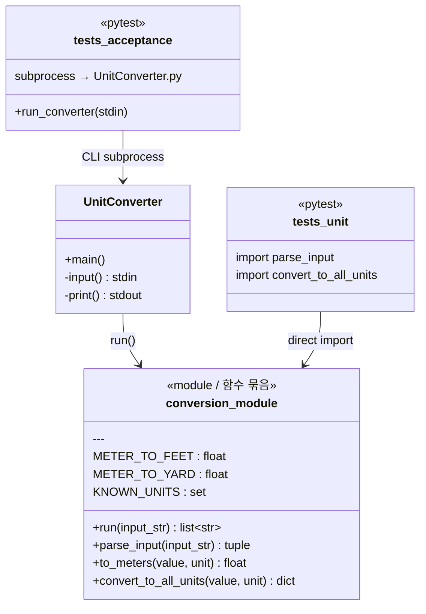
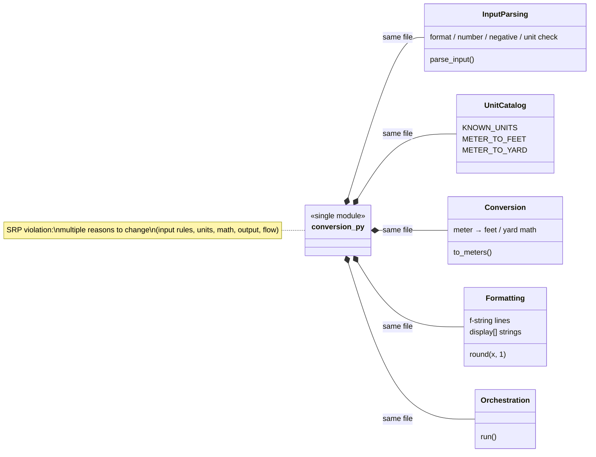
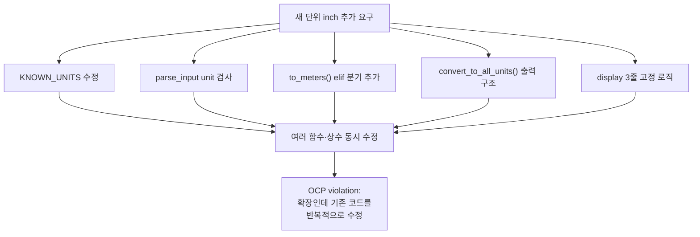
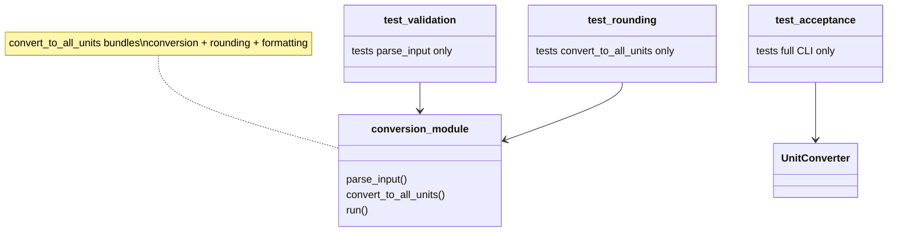

# As-Is Architecture — Green Phase (Current Code)

| Item | Value |
|------|-------|
| Phase | Green (pre-refactoring) |
| Branch baseline | `green` / `refactoring` start |
| Date | 2026-06-11 |
| Code | `conversion.py`, `UnitConverter.py` |

현재 코드에는 **Python `class`가 없음**. 아래 다이어그램은 **논리적 책임**을 UML 클래스 형태로 표현한다.

---

## 1. Module overview



**해석:** `conversion.py` **한 모듈**이 파싱·단위·변환·출력·흐름을 모두 담당한다. CLI(`UnitConverter.py`)만 I/O로 분리되어 있다.

---

## 2. SRP problem — overlapping responsibilities in `conversion.py`



| 겹친 책임 | 코드 | 바뀌면 수정하는 이유 |
|-----------|------|----------------------|
| 입력 검증 | `parse_input()` | 오류 메시지, 음수 규칙 |
| 단위·비율 | `KNOWN_UNITS`, `METER_TO_*` | 새 단위 추가 |
| 변환 | `to_meters()`, `convert_to_all_units()` | 비율·알고리즘 |
| 출력 | `display`, `:.1f` | JSON/CSV, 자릿수 |
| 흐름 | `run()` | 파이프라인 변경 |

---

## 3. OCP problem — adding `inch` (extension vs modification)



**해당 코드 (`to_meters`):**

```python
if unit == "meter":
    return value
if unit == "feet":
    return value / METER_TO_FEET
if unit == "yard":
    return value / METER_TO_YARD
```

단위가 늘 때마다 **분기·상수·출력**을 함께 고칠 가능성이 크다.

---

## 4. Test coupling



- Unit 테스트: **함수 일부**만 검증
- Acceptance: **CLI 전체**만 검증
- Registry / Formatter **단독 테스트 불가**

---

## 5. Summary — what works vs what to refactor

| 관점 | 현재 (Green) | 평가 |
|------|--------------|------|
| **기능** | AT-1~5, 11 tests Green | ✅ OK |
| **CLI SRP** | `UnitConverter.py` = I/O only | ✅ OK |
| **Domain SRP** | `conversion.py` = 다중 책임 | ⚠️ Refactor 대상 |
| **OCP** | `if/elif` + 하드코딩 상수 | ⚠️ Refactor 대상 |

**Next:** [to-be-class-diagram.md](./to-be-class-diagram.md)
