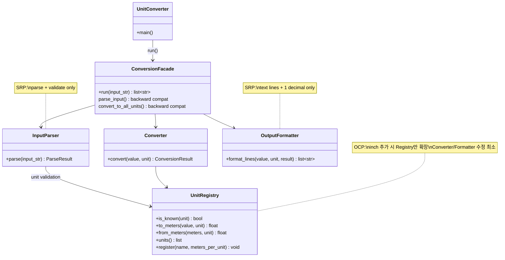
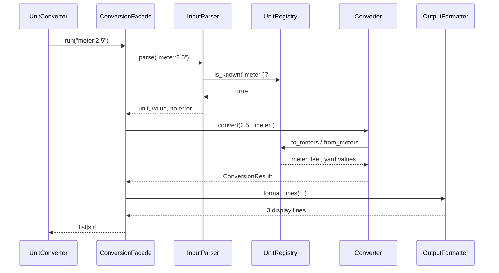

# To-Be Architecture — Refactoring Target

| Item | Value |
|------|-------|
| Phase | Refactoring (05) |
| Goals | SRP, OCP (README 품질 요구) |
| Constraints | 11 tests Green, step-04 제외 |
| Related | `doc/PRD.md` §8, `.cursor/commands/phase-refactoring.md` |

---

## 1. Target class diagram

---

## 2. Request flow (sequence)

**Error path:** `InputParser`가 오류 문자열 반환 → `run()`은 `[error]` 한 줄만 반환 (PRD §4).

---

## 3. OCP — adding `inch` (target behavior)

```mermaid
flowchart LR
    A["inch 추가"] --> B["UnitRegistry.register('inch', 0.0254)"]
    B --> C["InputParser: is_known → OK"]
    B --> D["Converter: generic math unchanged"]
    B --> E["OutputFormatter: loop known units\n(or fixed 3-unit policy)"]

    style B fill:#1a3a2a
    style D fill:#1a3a2a
```

**Scope note:** step-04(동적 런타임 등록, JSON/YAML)는 **제외**. To-Be Registry는 **코드/생성자에서 등록**으로 OCP를 **설명**한다.

---

## 4. SRP mapping — Green → To-Be

| Green (`conversion.py`) | To-Be class |
|-------------------------|-------------|
| `parse_input()` | `InputParser` |
| `KNOWN_UNITS`, `METER_TO_*` | `UnitRegistry` |
| `to_meters()`, 변환 계산 | `Converter` + `UnitRegistry` |
| `display`, `round`, `:.1f` | `OutputFormatter` |
| `run()` | `ConversionFacade` (or module-level facade) |

**Backward compatibility:** unit tests import `parse_input`, `convert_to_all_units` from `conversion` — facade가 위임 유지.

---

## 5. Out of scope (step-04)

| Not in refactoring | Reason |
|--------------------|--------|
| `config.json` / YAML load | README 추가 요구 — 제외 |
| User runtime `cubit` registration | 동적 등록 — 제외 |
| JSON / CSV output | 출력 포맷 선택 — 제외 |

Report/01 §7 다이어그램의 `config.json → UnitRegistry`는 **미래 확장** 그림이다.

---

## 6. Done criteria

- [ ] Classes/modules split per diagram
- [ ] `python -m pytest tests/` → **11 passed**
- [ ] `Report/05-refactoring-report.md` with Before/After reference to [as-is](./as-is-class-diagram.md)

**Before:** [as-is-class-diagram.md](./as-is-class-diagram.md)
